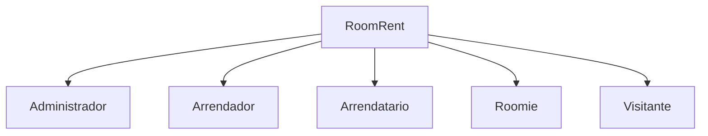
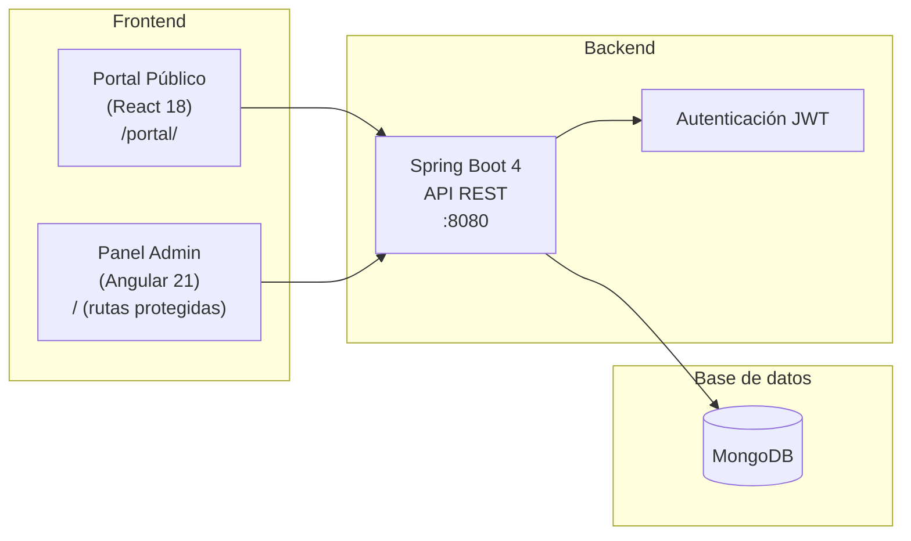

# 01 — Introducción a RoomRent

## Descripción del proyecto

**RoomRent** es una plataforma digital de arrendamiento de inmuebles diseñada para el mercado colombiano. Conecta arrendadores con arrendatarios y candidatos roomie a través de un proceso estructurado que va desde la publicación del inmueble hasta la firma del contrato digital y la calificación mutua de las partes.

El sistema está orientado a eliminar los intermediarios innecesarios, reducir el uso del papel y brindar a todas las partes un entorno seguro, trazable y auditable.

---

## Problema que resuelve

El proceso de arrendamiento en Colombia tiene múltiples fricciones:

| Problema | Impacto |
|---|---|
| Búsqueda de inmuebles dispersa en múltiples plataformas | Pérdida de tiempo y oportunidades |
| Verificación de identidad informal | Riesgo para arrendadores y arrendatarios |
| Contratos en papel, sin trazabilidad | Pérdida de documentos, litigios |
| Sin historial de cumplimiento | Imposible conocer el comportamiento pasado del inquilino |
| Proceso de visitas sin estructura | Visitas canceladas, falta de información |
| Habitaciones compartidas sin proceso formal | Sin contratos, sin derechos |
| Sin sistema de reputación entre usuarios | Desconfianza entre las partes |

RoomRent aborda todos estos problemas en una sola plataforma.

---

## Objetivos

### Objetivo general

Digitalizar y estructurar completamente el proceso de arrendamiento de inmuebles en Colombia, incluyendo la búsqueda, la verificación de usuarios, las visitas, la firma digital de contratos y el sistema de calificaciones.

### Objetivos específicos

1. Proveer un portal público donde los visitantes puedan explorar inmuebles disponibles sin necesidad de registrarse.
2. Permitir a los arrendadores registrar y gestionar sus inmuebles, publicaciones y contratos desde un panel centralizado.
3. Permitir a los arrendatarios buscar, filtrar, solicitar y contratar inmuebles de forma digital.
4. Soportar el modelo de co-habitación (roomies) con un flujo independiente y completo.
5. Implementar un sistema de reputación que genere confianza entre las partes basado en historial real.
6. Eliminar el uso del papel en los contratos de arrendamiento.
7. Proveer a los administradores herramientas de gestión y moderación del sistema.

---

## Alcance

### Incluido en el sistema

- Registro, verificación y gestión de perfiles de usuario
- Registro de inmuebles (unidades individuales y grupos de unidades)
- Publicaciones de inmuebles para arriendo
- Publicaciones de habitaciones para co-habitación (roomies)
- Galería multimedia por inmueble
- Solicitudes de arriendo y de roomie
- Programación y gestión de visitas presenciales
- Generación y firma digital de contratos de arrendamiento
- Sistema de calificaciones y reputación entre actores
- Panel de administración para moderación del sistema
- Portal público para visitantes no registrados

### Fuera del alcance (versión actual)

- Pagos en línea (pasarela de pagos)
- Seguimiento de pagos mensuales de arrendamiento
- Notificaciones push / correo electrónico automatizado (parcialmente implementado por JHipster)
- Mapa interactivo de inmuebles
- Chat entre usuarios
- Firma electrónica con validez legal colombiana (e.firma, firma avanzada)

> **Nota:** Los ítems fuera de alcance son candidatos para versiones futuras y están identificados en el roadmap.

---

## Tipos de usuarios

El sistema reconoce cinco tipos de actores:

| Actor | Descripción | Requiere cuenta |
|---|---|---|
| **Administrador** | Gestiona y modera el sistema completo | Sí (rol ADMIN) |
| **Arrendador** | Propietario o representante de inmuebles | Sí |
| **Arrendatario** | Persona que busca arrendar un inmueble | Sí |
| **Roomie** | Persona que busca co-habitar en un inmueble ya arrendado | Sí |
| **Visitante** | Usuario no registrado que navega el portal público | No |

> Un mismo usuario puede ejercer el rol de Arrendador en algunos inmuebles y el de Arrendatario en otros. El sistema no limita esto a nivel de cuenta.

---

## Arquitectura general del sistema

### Stack tecnológico

| Capa | Tecnología | Versión |
|---|---|---|
| Backend | Spring Boot | 4.0.6 |
| Base de datos | MongoDB | 7.x |
| Autenticación | JWT (stateless) | — |
| Admin frontend | Angular (standalone + signals) | 21.x |
| Portal público | React | 18.x |
| Generador base | JHipster | 9.1.0 |
| Build backend | Maven | 3.9+ |
| Java | Temurin JDK | 21 |

---

## Contexto de uso

RoomRent está pensado inicialmente para el mercado bogotano, con posibilidad de expansión nacional. El sistema maneja los estratos socioeconómicos 1–6, los tipos de documento colombianos (CC, CE, TI, NIT) y las convenciones de arriendo del país (cánon mensual, depósito, datacredito, fiador, etc.).
