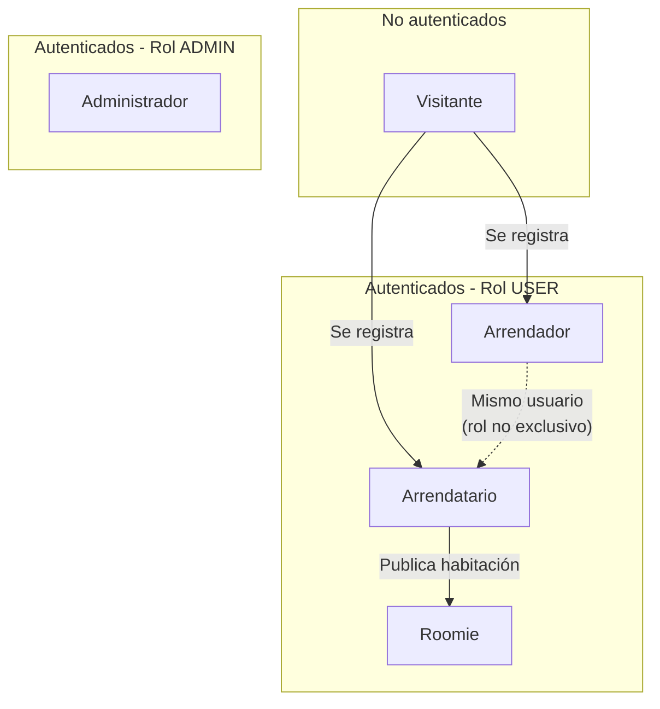
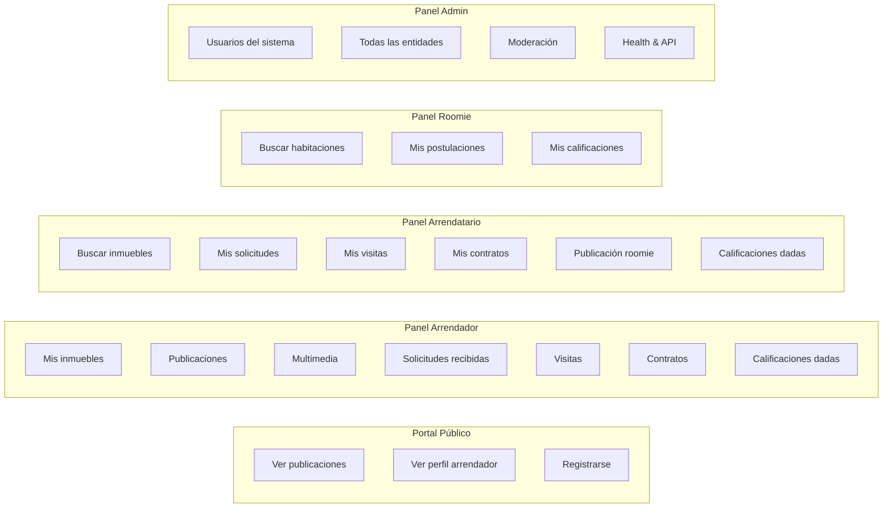

# 02 — Actores del sistema

## Diagrama de actores

---

## 1. Visitante

**Definición:** Usuario no autenticado que navega el portal público de RoomRent.

### Capacidades

| Acción | Descripción |
|---|---|
| Explorar inmuebles | Ver el listado de inmuebles publicados en el portal |
| Ver detalle de publicación | Ver fotos, descripción, precio y condiciones |
| Ver perfil público de arrendador | Nombre, calificación promedio, inmuebles publicados |
| Registrarse | Crear una cuenta nueva en la plataforma |
| Iniciar sesión | Acceder con cuenta existente |

### Restricciones

- No puede enviar solicitudes de arriendo
- No puede agendar visitas
- No puede ver datos de contacto del arrendador
- No puede acceder al panel de administración

---

## 2. Arrendador

**Definición:** Usuario registrado que posee o administra uno o más inmuebles y los ofrece en arriendo dentro de la plataforma.

> Un arrendador puede tener múltiples inmuebles y cada inmueble puede tener múltiples unidades independientes (ver [13-modelo-negocio.md](13-modelo-negocio.md)).

### Capacidades

#### Gestión de inmuebles

| Acción | Descripción |
|---|---|
| Registrar inmueble | Crear un nuevo inmueble con dirección, tipo, características físicas |
| Editar inmueble | Actualizar información del inmueble |
| Eliminar inmueble | Solo si no tiene contratos activos |
| Ver mis inmuebles | Listado de todos sus inmuebles con estado actual |

#### Gestión de publicaciones

| Acción | Descripción |
|---|---|
| Crear publicación | Publicar un inmueble con precio, condiciones y requisitos |
| Editar publicación | Actualizar precio, descripción, condiciones |
| Pausar publicación | Detener temporalmente sin perder el historial |
| Reactivar publicación | Volver a PUBLICADO |
| Finalizar publicación | Cerrar definitivamente |
| Ver solicitudes recibidas | Lista de arrendatarios interesados |

#### Gestión de multimedia

| Acción | Descripción |
|---|---|
| Subir fotos | Agregar imágenes del inmueble |
| Subir videos | Agregar recorridos virtuales |
| Definir foto principal | Imagen de portada de la publicación |
| Eliminar archivos multimedia | Remover fotos o videos |

#### Gestión de visitas

| Acción | Descripción |
|---|---|
| Ver visitas solicitadas | Listado de visitas pendientes de confirmación |
| Confirmar visita | Aceptar la fecha solicitada o proponer otra |
| Cancelar visita | Con razón documentada |
| Finalizar visita | Marcar como realizada con notas |

#### Gestión de solicitudes

| Acción | Descripción |
|---|---|
| Revisar solicitudes | Ver datos y mensaje del arrendatario |
| Aprobar solicitud | Aceptar al arrendatario para iniciar contrato |
| Rechazar solicitud | Con razón documentada |

#### Gestión de contratos

| Acción | Descripción |
|---|---|
| Generar contrato | Crear contrato con número único, fechas y valor |
| Adjuntar contrato digital | Subir URL del documento firmado |
| Registrar firma | Marcar fecha de firma del contrato |
| Finalizar contrato | Cerrar al término del periodo |

#### Calificaciones

| Acción | Descripción |
|---|---|
| Calificar arrendatario | Al finalizar el contrato (ARRENDADOR_A_ARRENDATARIO) |
| Ver mi calificación | Ver cómo lo calificaron los arrendatarios |

### Restricciones

- No puede aprobar su propia solicitud de arriendo en un inmueble propio
- No puede calificar a alguien con quien no tuvo un contrato finalizado

---

## 3. Arrendatario

**Definición:** Usuario registrado que busca arrendar un inmueble a través de la plataforma.

### Capacidades

#### Búsqueda y exploración

| Acción | Descripción |
|---|---|
| Buscar inmuebles | Por ciudad, barrio, tipo, precio |
| Filtrar resultados | Por múltiples criterios simultáneos |
| Ver detalle de publicación | Fotos, descripción, condiciones, arrendador |
| Ver perfil del arrendador | Reputación, historial, calificaciones |

#### Solicitudes

| Acción | Descripción |
|---|---|
| Enviar solicitud | Con mensaje personalizado y aceptación de términos |
| Ver estado de mis solicitudes | CREADA, EN_REVISION, APROBADA, RECHAZADA, CANCELADA |
| Cancelar solicitud | Antes de ser procesada |

#### Visitas

| Acción | Descripción |
|---|---|
| Solicitar visita | Proponer fecha para conocer el inmueble |
| Ver visitas programadas | Estado y confirmación de cada visita |
| Cancelar visita | Con razón documentada |

#### Contratos

| Acción | Descripción |
|---|---|
| Ver contrato | Visualizar el contrato generado |
| Firmar contrato | Confirmar la firma del documento |
| Ver historial de contratos | Contratos anteriores y vigentes |

#### Roomie (cuando aplica)

| Acción | Descripción |
|---|---|
| Publicar habitación | Si el inmueble arrendado lo permite, publicar cuarto disponible |
| Gestionar solicitudes roomie | Aprobar o rechazar candidatos |

#### Calificaciones

| Acción | Descripción |
|---|---|
| Calificar arrendador | Al finalizar contrato (ARRENDATARIO_A_ARRENDADOR) |
| Calificar roomie | Si compartió espacio (ARRENDATARIO_A_ROOMIE) |
| Ver mi calificación | Cómo lo calificaron los arrendadores |

### Restricciones

- Solo puede enviar solicitud a inmuebles con estado PUBLICADO
- No puede tener dos contratos vigentes para el mismo inmueble simultáneamente

---

## 4. Roomie

**Definición:** Usuario registrado que busca co-habitar en un inmueble ya arrendado, compartiendo espacio con el arrendatario principal.

> El Roomie actúa sobre publicaciones de tipo `PublicacionRoomie`, no sobre `PublicacionInmueble`. El flujo es independiente pero comparte parte de la infraestructura.

### Capacidades

#### Búsqueda

| Acción | Descripción |
|---|---|
| Buscar habitaciones disponibles | Por ciudad, precio, género preferido |
| Ver detalle de habitación | Descripción, servicios incluidos, espacios compartidos |
| Ver perfil del arrendatario que publica | Reputación, datos de convivencia |

#### Solicitudes

| Acción | Descripción |
|---|---|
| Postularse a habitación | Con mensaje y referencias |
| Ver estado de postulación | CREADA, EN_REVISION, APROBADA, RECHAZADA |
| Cancelar postulación | Antes de ser procesada |

#### Calificaciones

| Acción | Descripción |
|---|---|
| Calificar al arrendatario anfitrión | Al finalizar la convivencia (ROOMIE_A_ARRENDATARIO) |
| Ver mi calificación como roomie | Cómo lo calificaron |

### Perfil de roomie

El perfil de un candidato roomie debe revelar:

- Datos de convivencia: mascotas, fumador, horarios (pendiente de validación)
- Intereses declarados
- Referencias
- Calificaciones previas como roomie
- Habilitación `habilitadoRoomie` (flag en PerfilUsuario)

### Restricciones

- Solo puede postularse a publicaciones con estado PUBLICADO
- Su postulación requiere que `habilitadoRoomie = true` en su perfil

> **Pendiente de validación:** ¿El sistema debe exigir que `habilitadoRoomie = true` para postularse? ¿O es solo un indicador?

---

## 5. Administrador

**Definición:** Usuario con rol `ADMIN` que gestiona y modera toda la plataforma. Tiene acceso al panel de administración Angular.

### Capacidades

#### Gestión de usuarios

| Acción | Descripción |
|---|---|
| Listar usuarios del sistema | Ver todos los usuarios registrados |
| Activar / desactivar usuarios | Control de acceso |
| Asignar roles | ROLE_ADMIN / ROLE_USER |
| Editar perfil de cualquier usuario | Corrección de datos |
| Eliminar usuarios | Solo si no tienen contratos vigentes |

#### Moderación de contenido

| Acción | Descripción |
|---|---|
| Ver todas las publicaciones | Independientemente del estado |
| Pausar publicaciones | Por incumplimiento de términos |
| Eliminar publicaciones | Por contenido inapropiado |
| Aprobar documentos de verificación | Validar documentos cargados por usuarios |
| Rechazar documentos | Con observación |

#### Gestión de entidades

| Acción | Descripción |
|---|---|
| CRUD completo de todas las entidades | Acceso total al panel admin |
| Ver historial de contratos | Todos los contratos del sistema |
| Ver calificaciones | Todas las calificaciones y visibilidad |
| Moderar calificaciones | Ocultar (`visible = false`) calificaciones inapropiadas |

#### Herramientas del sistema

| Acción | Descripción |
|---|---|
| Ver Health Check | Estado del sistema Spring Boot |
| Ver API Docs (Swagger) | Documentación de la API REST |
| Gestión de usuarios del sistema | Panel `/admin/user-management` |

### Restricciones

- El administrador no puede eliminar su propio usuario desde el panel
- El administrador no puede desactivar su propia cuenta

---

## Resumen comparativo

