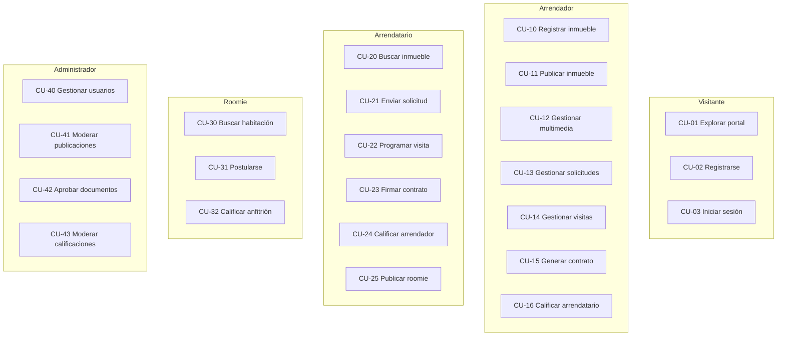

# 03 — Casos de uso

## Diagrama general

---

## CU-01 — Explorar portal público

| Campo | Valor |
|---|---|
| **ID** | CU-01 |
| **Nombre** | Explorar portal público |
| **Actor** | Visitante |
| **Precondiciones** | Ninguna |

**Flujo principal:**
1. El visitante accede a `roomrent.com`
2. El sistema muestra el portal público con inmuebles disponibles
3. El visitante navega el listado de publicaciones activas
4. El visitante selecciona una publicación
5. El sistema muestra el detalle: fotos, descripción, precio, condiciones, perfil del arrendador
6. El visitante puede ver la calificación y el historial público del arrendador

**Flujos alternativos:**
- 3a. El visitante aplica filtros (ciudad, tipo, precio). El sistema actualiza el listado.
- 5a. El visitante intenta enviar una solicitud. El sistema lo redirige al registro/login.

**Postcondiciones:**
- El visitante tiene información suficiente para decidir registrarse o continuar explorando.

---

## CU-02 — Registrarse

| Campo | Valor |
|---|---|
| **ID** | CU-02 |
| **Actor** | Visitante |
| **Precondiciones** | El usuario no tiene cuenta activa |

**Flujo principal:**
1. El visitante hace clic en "Crear cuenta"
2. El sistema presenta el formulario de registro (usuario, email, contraseña)
3. El visitante completa el formulario y envía
4. El sistema valida que el usuario y email no estén en uso
5. El sistema crea la cuenta en estado inactivo
6. El sistema envía un correo de activación
7. El visitante hace clic en el enlace del correo
8. El sistema activa la cuenta
9. El sistema redirige al login

**Flujos alternativos:**
- 4a. El email ya existe → el sistema informa y sugiere recuperar contraseña.
- 4b. El nombre de usuario ya existe → el sistema solicita otro.
- 7a. El enlace expiró (24h) → el sistema permite reenviar el correo.

**Postcondiciones:**
- El usuario tiene cuenta activa con rol `ROLE_USER`.
- El perfil extendido (`PerfilUsuario`) aún no ha sido completado.

> **Pendiente de validación:** ¿El sistema debe forzar el completado del `PerfilUsuario` antes de permitir cualquier acción?

---

## CU-03 — Iniciar sesión

| Campo | Valor |
|---|---|
| **ID** | CU-03 |
| **Actor** | Cualquier usuario registrado |
| **Precondiciones** | El usuario tiene cuenta activa |

**Flujo principal:**
1. El usuario accede al formulario de login
2. Ingresa usuario y contraseña
3. El sistema valida las credenciales
4. El sistema genera un token JWT
5. El sistema almacena el token en el cliente
6. El sistema redirige al dashboard correspondiente

**Flujos alternativos:**
- 3a. Credenciales incorrectas → mensaje de error, el formulario se limpia.
- 3b. Cuenta inactiva → mensaje informando que debe activar la cuenta.
- 3c. Cuenta bloqueada o baneada → mensaje específico por estado.

**Postcondiciones:**
- El usuario está autenticado. El token JWT tiene vigencia configurable.

---

## CU-10 — Registrar inmueble

| Campo | Valor |
|---|---|
| **ID** | CU-10 |
| **Actor** | Arrendador |
| **Precondiciones** | El arrendador tiene sesión activa y perfil completo |

**Flujo principal:**
1. El arrendador accede a "Mis inmuebles" → "Nuevo inmueble"
2. El sistema presenta el formulario de registro
3. El arrendador ingresa: nombre, dirección, ciudad, barrio, tipo, área, habitaciones, baños, estrato
4. El arrendador guarda el inmueble
5. El sistema crea el registro vinculando el inmueble a su perfil
6. El sistema redirige al detalle del inmueble creado

**Flujos alternativos:**
- 3a. El arrendador omite campos requeridos → el sistema informa qué campos faltan.

**Postcondiciones:**
- El inmueble queda registrado sin publicación activa.
- El arrendador puede agregar multimedia y crear publicaciones.

---

## CU-11 — Publicar inmueble

| Campo | Valor |
|---|---|
| **ID** | CU-11 |
| **Actor** | Arrendador |
| **Precondiciones** | El inmueble existe y no tiene publicación en estado PUBLICADO |

**Flujo principal:**
1. El arrendador accede al inmueble → "Nueva publicación"
2. El sistema presenta el formulario de publicación
3. El arrendador ingresa: título, descripción, canon de arriendo, depósito, requisitos, fecha disponible, condiciones de convivencia
4. El arrendador selecciona el estado inicial (BORRADOR o PUBLICADO)
5. El sistema guarda la publicación vinculada al inmueble
6. Si el estado es PUBLICADO, la publicación aparece en el portal

**Flujos alternativos:**
- 4a. El arrendador elige BORRADOR → la publicación no es visible en el portal.
- 4b. El arrendador intenta publicar y ya hay una publicación PUBLICADA → el sistema advierte.

**Postcondiciones:**
- La publicación queda registrada. Si está PUBLICADA, los arrendatarios pueden verla y solicitar.

---

## CU-12 — Gestionar multimedia del inmueble

| Campo | Valor |
|---|---|
| **ID** | CU-12 |
| **Actor** | Arrendador |
| **Precondiciones** | El inmueble existe |

**Flujo principal:**
1. El arrendador accede al inmueble → "Multimedia"
2. El sistema muestra la galería actual con las fotos y videos cargados
3. El arrendador sube un nuevo archivo (URL del archivo almacenado)
4. El arrendador indica si es el archivo principal (portada)
5. El arrendador agrega un título opcional
6. El sistema guarda el registro vinculado al inmueble

**Flujos alternativos:**
- 4a. El arrendador marca un archivo como principal y ya existía uno → el sistema reemplaza el anterior como principal.
- 3a. El arrendador elimina un archivo → el sistema lo remueve del registro.

**Postcondiciones:**
- El inmueble tiene multimedia actualizada. La foto principal es la que aparece en el listado.

> **Pendiente de validación:** ¿El sistema debe validar formatos y tamaños de archivo? ¿Usa almacenamiento propio o URLs externas?

---

## CU-13 — Gestionar solicitudes de arriendo

| Campo | Valor |
|---|---|
| **ID** | CU-13 |
| **Actor** | Arrendador |
| **Precondiciones** | La publicación tiene solicitudes en estado CREADA o EN_REVISION |

**Flujo principal:**
1. El arrendador accede a una publicación → "Solicitudes"
2. El sistema lista todas las solicitudes con su estado
3. El arrendador selecciona una solicitud y la revisa
4. El arrendador cambia el estado a EN_REVISION
5. El arrendador puede aprobar o rechazar la solicitud
6. Si aprueba → la solicitud pasa a APROBADA y puede iniciar el proceso de contrato
7. Si rechaza → la solicitud pasa a RECHAZADA con razón opcional

**Flujos alternativos:**
- 5a. El arrendador aprueba múltiples solicitudes → el sistema lo permite pero advierte que solo puede existir un contrato vigente simultáneo.

**Postcondiciones:**
- La solicitud tiene estado actualizado.
- Una solicitud APROBADA habilita la creación del contrato.

---

## CU-14 — Gestionar visitas

| Campo | Valor |
|---|---|
| **ID** | CU-14 |
| **Actor** | Arrendador y Arrendatario |
| **Precondiciones** | Existe una solicitud en estado APROBADA o EN_REVISION |

**Flujo del arrendatario (solicitar):**
1. El arrendatario accede a su solicitud aprobada
2. Solicita una visita con fecha y hora preferida
3. El sistema crea la visita en estado SOLICITADA

**Flujo del arrendador (responder):**
1. El arrendador ve la visita en estado SOLICITADA
2. El arrendador confirma la fecha o propone otra
3. Si confirma → la visita pasa a CONFIRMADA
4. El arrendador puede agregar notas

**Postcondiciones:**
- La visita queda en estado CONFIRMADA, CANCELADA o FINALIZADA.

---

## CU-15 — Generar y firmar contrato

| Campo | Valor |
|---|---|
| **ID** | CU-15 |
| **Actor** | Arrendador (genera), Arrendatario (firma) |
| **Precondiciones** | Solicitud en estado APROBADA |

**Flujo principal:**
1. El arrendador genera el contrato con: número único, fechas, valor mensual, depósito
2. El contrato queda en estado BORRADOR
3. El arrendador adjunta el documento digital (URL)
4. El contrato pasa a PENDIENTE_FIRMA
5. El arrendatario recibe notificación y firma
6. El arrendador registra la fecha de firma
7. El contrato pasa a VIGENTE

**Postcondiciones:**
- El contrato está en estado VIGENTE y vincula al arrendador, arrendatario e inmueble.

---

## CU-16 — Calificar al finalizar contrato

| Campo | Valor |
|---|---|
| **ID** | CU-16 |
| **Actor** | Arrendador y Arrendatario |
| **Precondiciones** | El contrato está en estado FINALIZADO o CANCELADO |

**Flujo principal:**
1. El sistema habilita la calificación al cerrar el contrato
2. El arrendador califica al arrendatario (1-5 estrellas + comentario)
3. El arrendatario califica al arrendador (1-5 estrellas + comentario)
4. Las calificaciones quedan en estado `visible = true` por defecto
5. El administrador puede moderar calificaciones inapropiadas

**Postcondiciones:**
- Ambas partes tienen una nueva calificación en su historial.

---

## CU-20 — Buscar y filtrar inmuebles

| Campo | Valor |
|---|---|
| **ID** | CU-20 |
| **Actor** | Arrendatario, Visitante |
| **Precondiciones** | Ninguna |

**Flujo principal:**
1. El usuario accede al portal de búsqueda
2. El sistema muestra publicaciones en estado PUBLICADO
3. El usuario aplica filtros: ciudad, tipo, precio mínimo/máximo, características
4. El sistema actualiza el listado en tiempo real
5. El usuario selecciona una publicación y ve el detalle

**Postcondiciones:**
- El usuario tiene información suficiente para enviar una solicitud.

---

## CU-21 — Enviar solicitud de arriendo

| Campo | Valor |
|---|---|
| **ID** | CU-21 |
| **Actor** | Arrendatario |
| **Precondiciones** | El arrendatario tiene sesión activa. La publicación está en estado PUBLICADO. |

**Flujo principal:**
1. El arrendatario accede al detalle de la publicación
2. Hace clic en "Solicitar"
3. El sistema muestra el formulario de solicitud
4. El arrendatario escribe un mensaje y acepta los términos
5. El sistema crea la solicitud en estado CREADA
6. El sistema notifica al arrendador

**Flujos alternativos:**
- 3a. El arrendatario ya tiene una solicitud activa para esa publicación → el sistema informa y no permite duplicar.

**Postcondiciones:**
- La solicitud queda en estado CREADA y visible para el arrendador.

---

## CU-25 — Publicar habitación para roomie

| Campo | Valor |
|---|---|
| **ID** | CU-25 |
| **Actor** | Arrendatario |
| **Precondiciones** | El arrendatario tiene un contrato VIGENTE y el inmueble permite roomies (`permiteRoomies = true`) |

**Flujo principal:**
1. El arrendatario accede a "Mis publicaciones roomie" → "Nueva publicación"
2. Completa: título, nombre de la habitación, valor mensual, servicios incluidos, espacios compartidos, género preferido, fecha disponible
3. El sistema vincula la publicación a su inmueble y a su perfil
4. La publicación queda en estado PUBLICADO (o BORRADOR)

**Postcondiciones:**
- Los candidatos roomie pueden ver y postularse a la habitación.

---

## CU-30 — Buscar y postularse a habitación roomie

| Campo | Valor |
|---|---|
| **ID** | CU-30 / CU-31 |
| **Actor** | Roomie |
| **Precondiciones** | El usuario tiene `habilitadoRoomie = true` |

**Flujo principal:**
1. El roomie accede al portal de búsqueda de habitaciones
2. Aplica filtros: ciudad, precio, género preferido
3. Selecciona una habitación y ve el detalle
4. Hace clic en "Postularme"
5. El sistema muestra el formulario de solicitud roomie
6. El roomie escribe mensaje y referencias
7. El sistema crea la solicitud en estado CREADA

**Postcondiciones:**
- La solicitud roomie está en estado CREADA y visible para el arrendatario anfitrión.

---

## CU-40 — Gestionar usuarios (Administrador)

| Campo | Valor |
|---|---|
| **ID** | CU-40 |
| **Actor** | Administrador |
| **Precondiciones** | El administrador tiene sesión activa con rol ADMIN |

**Flujo principal:**
1. El administrador accede al panel → "Usuarios del sistema"
2. El sistema lista todos los usuarios con su estado y roles
3. El administrador puede: activar, desactivar, editar o cambiar el rol de cualquier usuario
4. El administrador puede crear nuevos usuarios directamente

**Postcondiciones:**
- Los cambios en estado y rol del usuario surten efecto inmediatamente.

---

## CU-42 — Aprobar documentos de verificación

| Campo | Valor |
|---|---|
| **ID** | CU-42 |
| **Actor** | Administrador |
| **Precondiciones** | El usuario cargó documentos en estado sin aprobar |

**Flujo principal:**
1. El administrador accede a "Documentos"
2. Revisa los documentos cargados por los usuarios
3. Para cada documento, puede: aprobar o rechazar con observación
4. Si aprueba, el campo `aprobado = true`
5. Si rechaza, agrega observaciones en el campo correspondiente

**Postcondiciones:**
- El documento queda con estado de aprobación registrado.
- El usuario puede ver el estado de verificación de sus documentos.

> **Pendiente de validación:** ¿El sistema debe cambiar automáticamente el campo `verificado` del `PerfilUsuario` cuando todos sus documentos requeridos sean aprobados?
