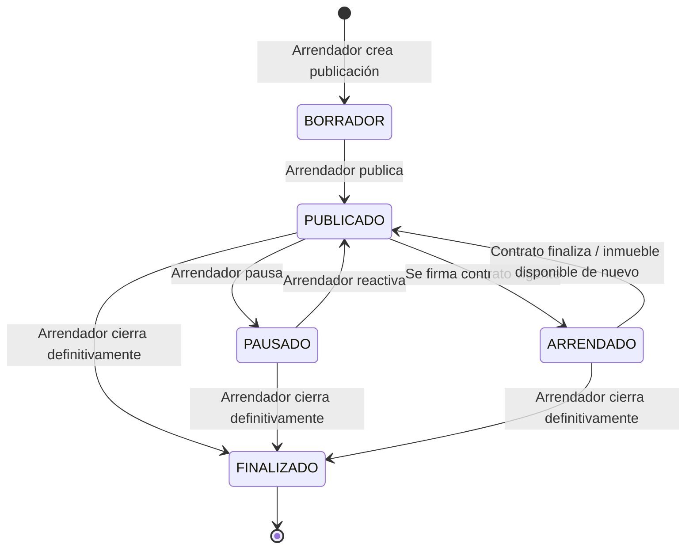
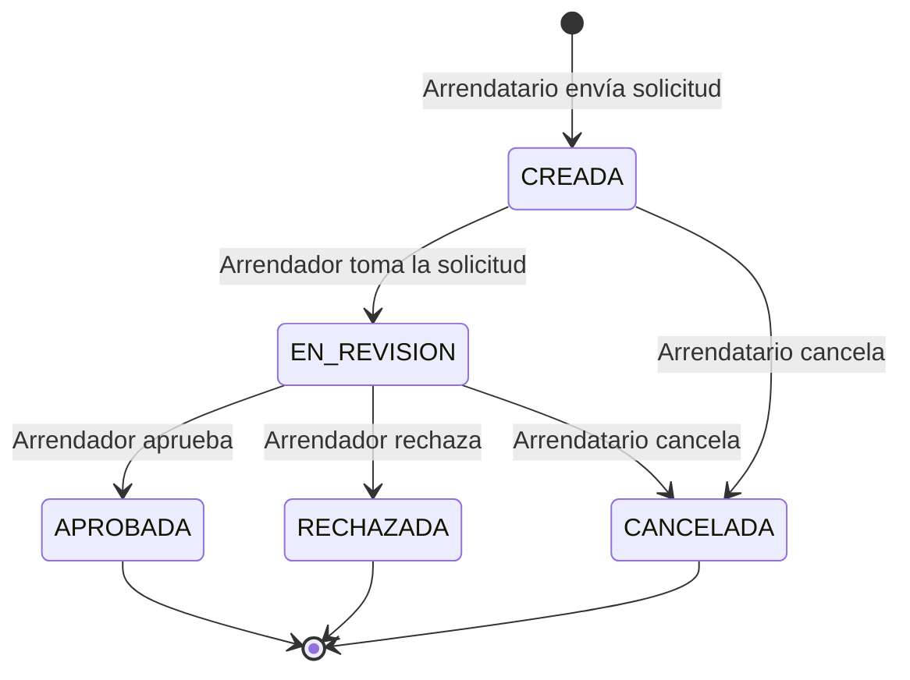
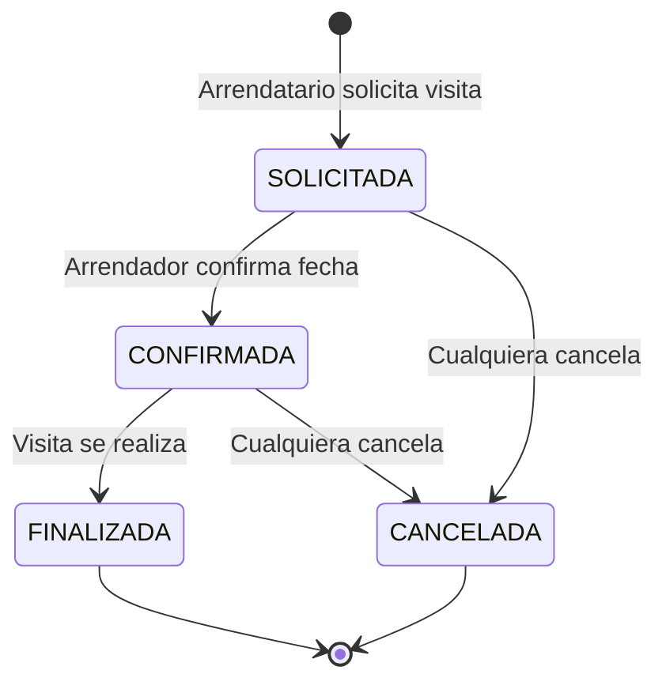
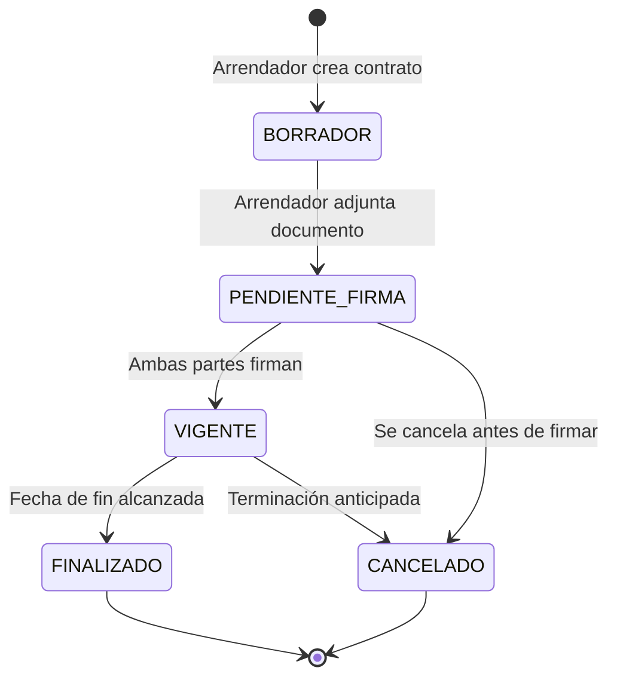
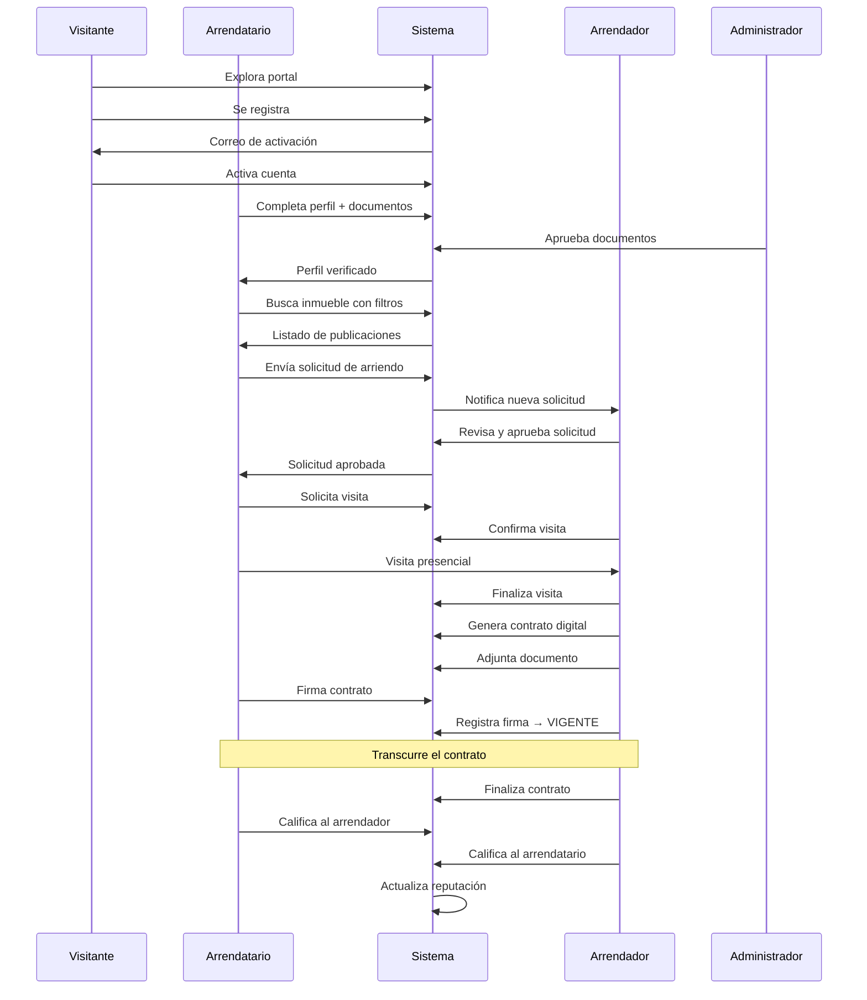

# 04 — Flujo general del sistema

Este diagrama representa el ciclo de vida completo desde que un usuario llega al sistema por primera vez hasta que un contrato de arrendamiento termina y se califica.

## Flujo completo: visitante → contrato finalizado

```mermaid
flowchart TD
    START([Usuario llega al portal]) --> PORTAL[Explorar inmuebles\npúblicamente]

    PORTAL --> DECISION_AUTH{¿Quiere\ninteractuar?}
    DECISION_AUTH -->|No| PORTAL
    DECISION_AUTH -->|Sí| REGISTRO[Registrarse /\nIniciar sesión]

    REGISTRO --> ACTIVAR[Activar cuenta\npor correo]
    ACTIVAR --> PERFIL[Completar\nPerfilUsuario]
    PERFIL --> DOCS[Cargar documentos\nde verificación]
    DOCS --> ADMIN_APRUEBA{Administrador\naprueba docs}

    ADMIN_APRUEBA -->|Documentos aprobados| VERIFICADO[Perfil verificado\nverificado = true]
    ADMIN_APRUEBA -->|Rechazados| DOCS

    VERIFICADO --> ROL{¿Qué rol\nejercerá?}

    %% RAMA ARRENDADOR
    ROL -->|Arrendador| ARR_INMUEBLE[Registrar inmueble]
    ARR_INMUEBLE --> ARR_MULTIMEDIA[Cargar multimedia\nfotos y videos]
    ARR_MULTIMEDIA --> ARR_PUBLICACION[Crear publicación\nde arriendo]
    ARR_PUBLICACION --> ARR_ESPERA[Esperar solicitudes]
    ARR_ESPERA --> ARR_SOLICITUD[Revisar solicitud\nrecibida]
    ARR_SOLICITUD -->|Rechaza| ARR_ESPERA
    ARR_SOLICITUD -->|Aprueba| ARR_VISITA[Confirmar visita\ndel arrendatario]
    ARR_VISITA --> ARR_CONTRATO[Generar contrato\ndigital]
    ARR_CONTRATO --> ARR_FIRMA[Registrar firma\ndel contrato]
    ARR_FIRMA --> ARR_VIGENTE[Contrato VIGENTE]

    %% RAMA ARRENDATARIO
    ROL -->|Arrendatario| ART_BUSCAR[Buscar inmuebles\ncon filtros]
    ART_BUSCAR --> ART_DETALLE[Ver detalle\nde publicación]
    ART_DETALLE --> ART_SOLICITUD[Enviar solicitud\nde arriendo]
    ART_SOLICITUD --> ART_ESPERA{Esperar respuesta\ndel arrendador}
    ART_ESPERA -->|Rechazada| ART_BUSCAR
    ART_ESPERA -->|Aprobada| ART_VISITA[Solicitar y\nasistir a visita]
    ART_VISITA --> ART_CONTRATO[Revisar y\nfirmar contrato]
    ART_CONTRATO --> ART_VIGENTE[Contrato VIGENTE]

    %% RAMA ROOMIE
    ROL -->|Roomie| ROO_BUSCAR[Buscar habitaciones\nroomie]
    ROO_BUSCAR --> ROO_DETALLE[Ver detalle\nde habitación]
    ROO_DETALLE --> ROO_SOLICITUD[Postularse a\nhabitación]
    ROO_SOLICITUD --> ROO_ESPERA{Esperar respuesta\ndel anfitrión}
    ROO_ESPERA -->|Rechazada| ROO_BUSCAR
    ROO_ESPERA -->|Aprobada| ROO_ACUERDO[Acuerdo de\nconvivencia]
    ROO_ACUERDO --> ROO_VIGENTE[Convivencia activa]

    %% CONVERGENCIA - CONTRATO FINALIZA
    ARR_VIGENTE --> FIN_CONTRATO{Contrato\ntermina}
    ART_VIGENTE --> FIN_CONTRATO
    FIN_CONTRATO -->|Fecha vencimiento| FINALIZADO[Estado: FINALIZADO]
    FIN_CONTRATO -->|Cancelación anticipada| CANCELADO[Estado: CANCELADO]

    FINALIZADO --> CALIFICACION[Calificación mutua\narrendador ↔ arrendatario]
    CANCELADO --> CALIFICACION
    CALIFICACION --> REPUTACION[Actualización\nde reputación]
    REPUTACION --> END([Ciclo completado])

    ROO_VIGENTE --> ROO_FIN[Fin de convivencia]
    ROO_FIN --> ROO_CALIFICACION[Calificación mutua\nroomie ↔ arrendatario]
    ROO_CALIFICACION --> REPUTACION
```

---

## Flujo de estados de cada entidad principal

### Estado de una Publicación de Inmueble

### Estado de una Solicitud de Arriendo

### Estado de una Visita

### Estado de un Contrato

---

## Mapa de interacción entre actores

