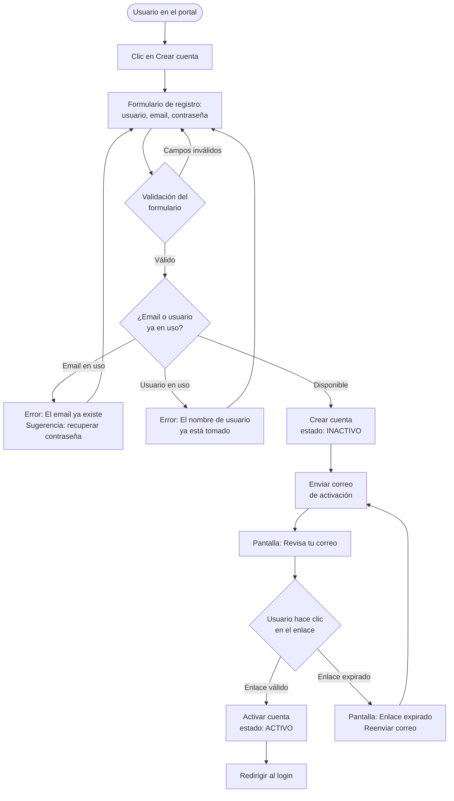
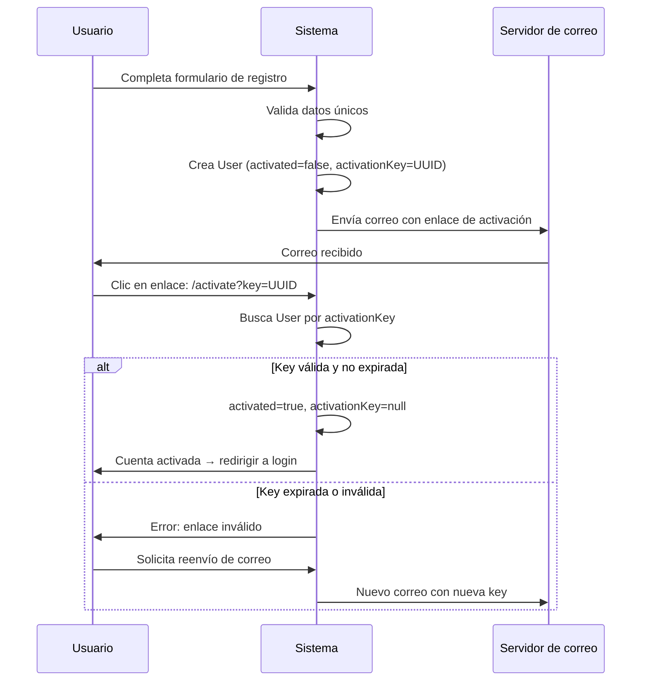
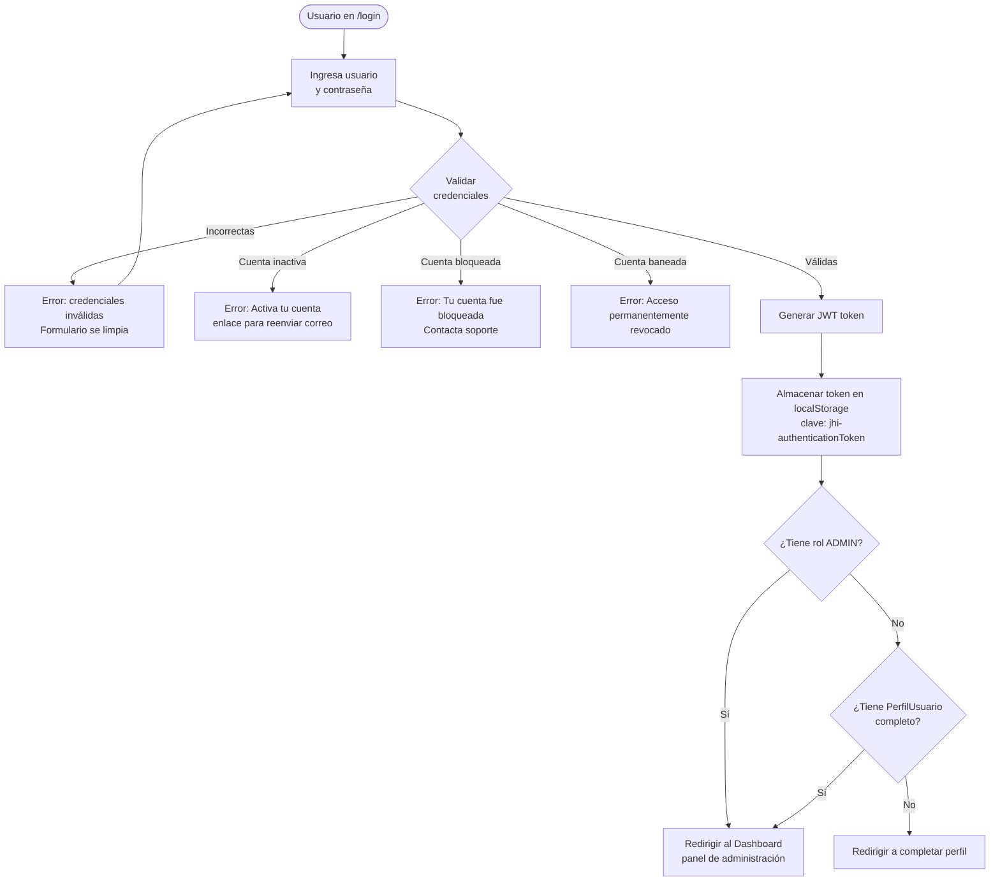
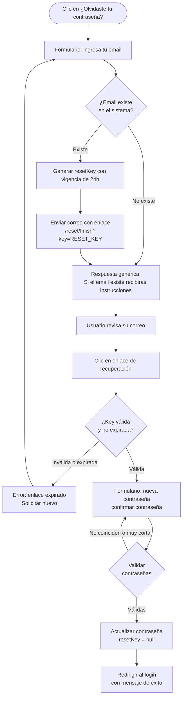
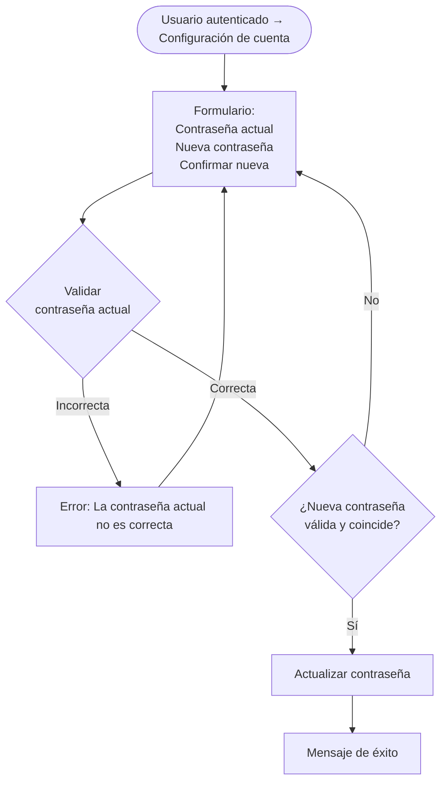
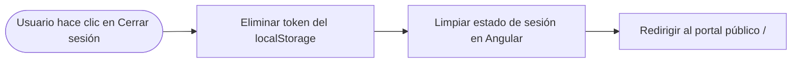

# 05 — Registro, autenticación y gestión de cuenta

## Estado actual de implementación

El sistema utiliza el módulo de autenticación estándar de JHipster 9 con JWT. El flujo de registro incluye activación por correo electrónico (implementado por JHipster vía `MailService`). Existe un formulario de recuperación de contraseña y cambio de contraseña.

---

## 1. Registro de nueva cuenta

### Campos del formulario de registro

| Campo | Requerido | Validación |
|---|---|---|
| Nombre de usuario | Sí | Único, 1-50 chars, sin espacios |
| Email | Sí | Único, formato email válido |
| Contraseña | Sí | Mínimo 4 caracteres |
| Confirmar contraseña | Sí | Debe coincidir con contraseña |

### Notas importantes

- La cuenta recién creada tiene el rol `ROLE_USER` por defecto.
- El perfil extendido (`PerfilUsuario`) aún no existe en este punto.
- El campo `activated` en `User` pasa de `false` a `true` al hacer clic en el enlace.

> **Pendiente de validación:** ¿El sistema debe solicitar el `PerfilUsuario` inmediatamente después del primer login, o puede el usuario navegar sin completarlo?

---

## 2. Activación de cuenta por correo

---

## 3. Inicio de sesión

### Estructura del JWT

El token JWT contiene:
- `sub`: nombre de usuario
- `auth`: roles (`ROLE_ADMIN`, `ROLE_USER`)
- `exp`: timestamp de expiración

El token se almacena en `localStorage` bajo la clave `jhi-authenticationToken` (con o sin comillas JSON dependiendo de la opción "Recordarme").

---

## 4. Recuperación de contraseña

> **Nota de seguridad:** El sistema siempre responde con el mismo mensaje ("si el email existe...") para no revelar si un email está registrado.

---

## 5. Cambio de contraseña (autenticado)

---

## 6. Cerrar sesión

El cierre de sesión es puramente del lado del cliente (eliminar el JWT del `localStorage`). El token JWT no se invalida en el servidor — expirará naturalmente. Si se requiere invalidación inmediata, se necesitaría una lista de tokens revocados en el servidor.

> **Pendiente de validación:** ¿Se requiere invalidación del token en el servidor al hacer logout? ¿Se manejarán sesiones concurrentes desde múltiples dispositivos?

---

## 7. Resumen de endpoints de autenticación (API REST)

| Método | Endpoint | Descripción |
|---|---|---|
| `POST` | `/api/authenticate` | Login, devuelve JWT |
| `POST` | `/api/register` | Registro de nueva cuenta |
| `GET` | `/api/activate?key=` | Activación de cuenta |
| `POST` | `/api/account/reset-password/init` | Solicitar reset de contraseña |
| `POST` | `/api/account/reset-password/finish` | Finalizar reset con nueva clave |
| `POST` | `/api/account/change-password` | Cambiar contraseña (autenticado) |
| `GET` | `/api/account` | Obtener datos de la cuenta actual |
| `POST` | `/api/account` | Actualizar datos de la cuenta |
