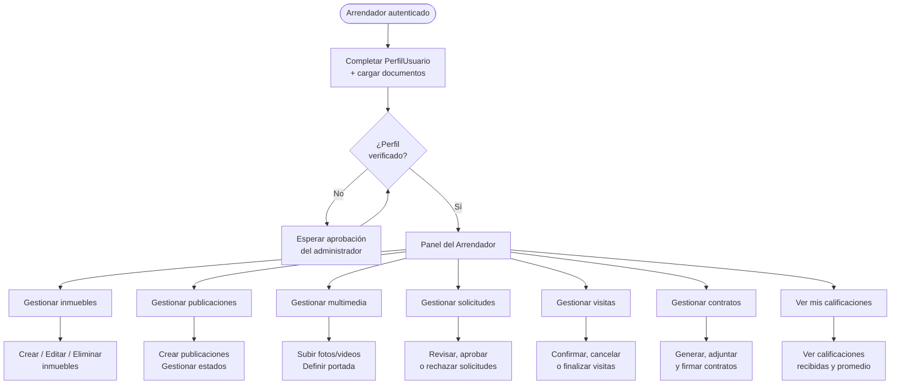
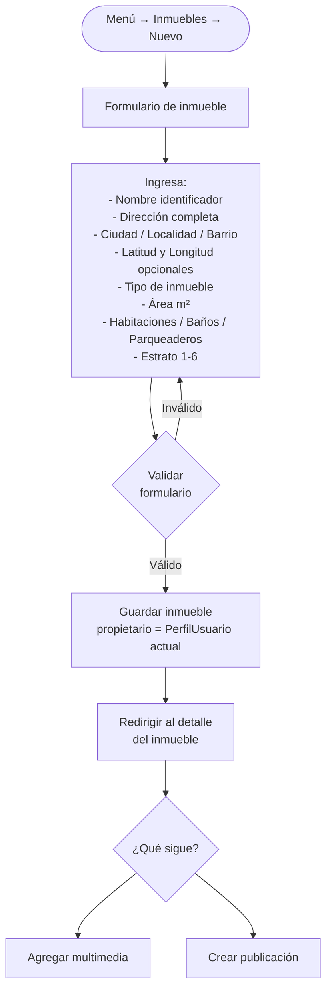
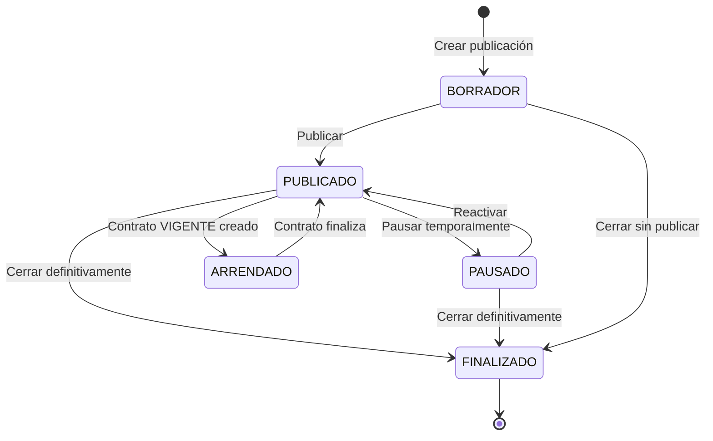
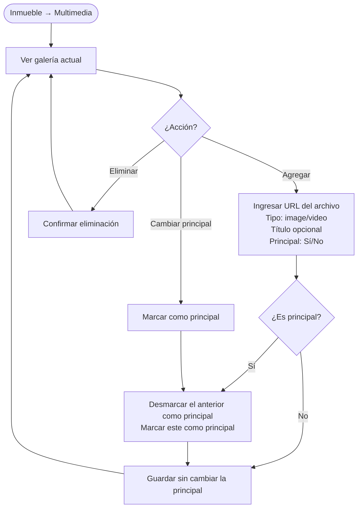
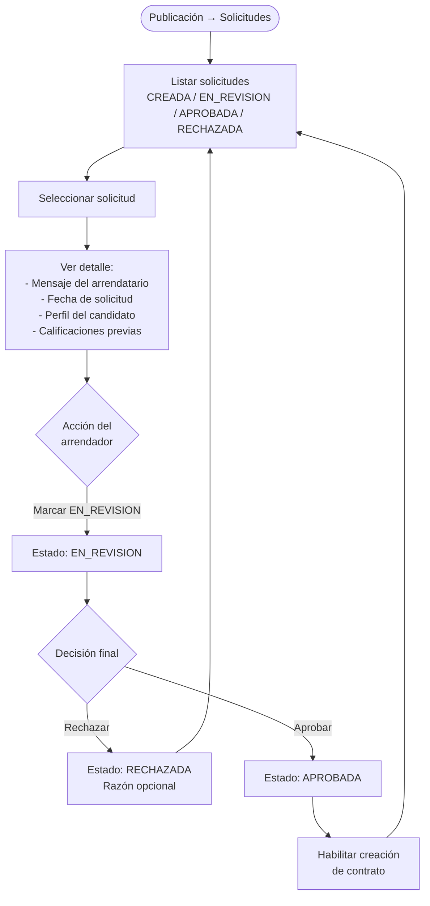
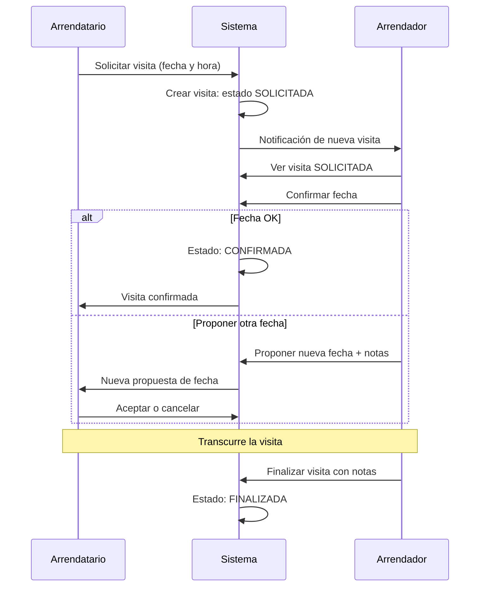
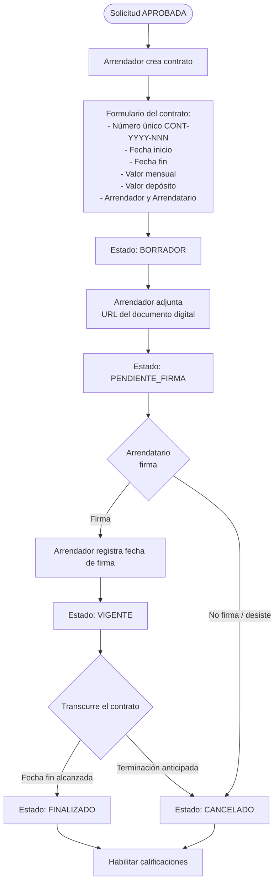

# 06 — Flujo del Arrendador

## Descripción del rol

El arrendador es el usuario que posee o administra inmuebles y los ofrece en arriendo. Puede tener múltiples inmuebles, y cada inmueble puede tener múltiples unidades arrendables de forma independiente.

---

## Flujo completo del arrendador

---

## 1. Gestión de inmuebles

### Crear un inmueble

### Tipos de inmueble disponibles

| Tipo | Descripción |
|---|---|
| `APARTAMENTO` | Unidad en edificio o conjunto |
| `CASA` | Inmueble independiente |
| `HABITACION` | Cuarto dentro de casa o apartamento |
| `APARTAESTUDIO` | Unidad compacta integrada |
| `LOCAL` | Espacio comercial |
| `OFICINA` | Espacio de trabajo |
| `OTRO` | No clasificable en los anteriores |

> **Nota del modelo:** El sistema actual trata cada unidad (apartamento, habitación, local) como un `Inmueble` independiente. Un edificio con 10 apartamentos requiere 10 registros de `Inmueble`. Ver [13-modelo-negocio.md](13-modelo-negocio.md) para la evolución propuesta con entidad `Edificio`.

---

## 2. Gestión de publicaciones

Una publicación es el anuncio activo de un inmueble. Un inmueble puede tener múltiples publicaciones a lo largo del tiempo (rearrendamiento), pero solo debería haber una PUBLICADA simultáneamente.

### Ciclo de vida de una publicación

### Campos de una publicación

| Campo | Requerido | Descripción |
|---|---|---|
| Título | Sí | Nombre atractivo para el anuncio |
| Descripción | No | Texto detallado del inmueble |
| Canon de arriendo | Sí | Valor mensual en pesos colombianos |
| Depósito | No | Meses de depósito requeridos |
| Requisitos | No | Condiciones para el arrendatario |
| Seguro requerido | No | Si requiere póliza de seguros |
| Datacredito requerido | No | Si se consultará historial crediticio |
| Fecha disponible | No | Desde cuándo está disponible |
| Estado | Sí | BORRADOR / PUBLICADO |
| Permite roomies | Sí | Si el arrendatario puede subarrendar habitaciones |
| Acepta mascotas | Sí | |
| Permite fumadores | Sí | |
| Permite niños | Sí | |
| Permite visitas | Sí | Si los inquilinos pueden recibir visitas |
| Permite parejas | Sí | |

---

## 3. Gestión de multimedia

### Tipos de multimedia

| Tipo | tipoMedia | Descripción |
|---|---|---|
| Foto | `image/jpeg`, `image/png`, `image/webp` | Fotos del inmueble |
| Video | `video/mp4`, `video/webm` | Recorridos virtuales |
| Plano | `application/pdf`, `image/png` | Planos arquitectónicos |

> **Pendiente de validación:** ¿El sistema gestionará el almacenamiento de archivos (upload real) o solo registrará URLs de archivos ya almacenados en un servicio externo (S3, Cloudinary, etc.)?

---

## 4. Gestión de solicitudes recibidas

### Notas sobre solicitudes

- El arrendador puede tener múltiples solicitudes APROBADAS simultáneamente, pero solo debe generar un contrato a la vez.
- Las solicitudes no aprobadas quedan en el historial del sistema.
- El arrendatario recibe notificación del cambio de estado.

> **Pendiente de validación:** ¿El sistema debe bloquear automáticamente las solicitudes restantes cuando ya hay un contrato VIGENTE para esa publicación?

---

## 5. Gestión de visitas

---

## 6. Generación y gestión de contratos

### Campos del contrato

| Campo | Requerido | Descripción |
|---|---|---|
| Número de contrato | Sí | Único, formato CONT-YYYY-NNN |
| URL contrato digital | No | Enlace al documento firmado |
| Fecha inicio | Sí | Inicio del periodo de arriendo |
| Fecha fin | Sí | Fin del periodo acordado |
| Valor mensual | Sí | Canon de arriendo en pesos |
| Valor depósito | No | Monto del depósito |
| Estado | Sí | Ver ciclo de vida |
| Fecha de firma | No | Cuando ambas partes firman |

---

## 7. Calificaciones como arrendador

Al finalizar un contrato, el arrendador puede calificar al arrendatario:

- **Tipo:** `ARRENDADOR_A_ARRENDATARIO`
- **Puntaje:** 1 a 5 estrellas
- **Comentario:** Texto libre (visible para todos si `visible = true`)
- **Vinculado a:** El contrato finalizado

El arrendador también puede ver cómo lo calificaron los arrendatarios anteriores, incluyendo:
- Promedio de puntaje
- Historial de calificaciones con comentarios
- Contratos completados vs cancelados

---

## 8. Consideraciones especiales

### Múltiples inmuebles

Un arrendador puede tener varios inmuebles bajo su perfil. El sistema no limita la cantidad. Cada inmueble tiene su propio ciclo de vida independiente.

### Inmueble con restricción de eliminación

Un inmueble no debería poder eliminarse si tiene:
- Contratos en estado VIGENTE
- Solicitudes en estado APROBADA o EN_REVISION
- Publicaciones en estado PUBLICADO o ARRENDADO

> **Pendiente de validación:** ¿Cuáles son exactamente las restricciones para eliminar un inmueble? ¿Se elimina en cascada o solo se desactiva?
