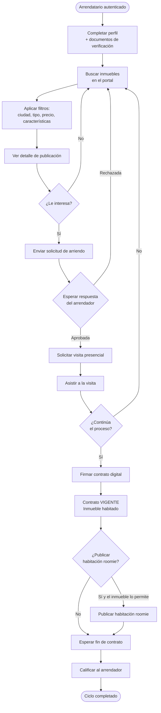
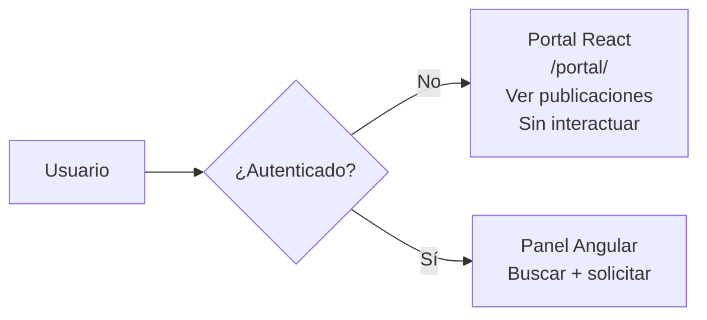
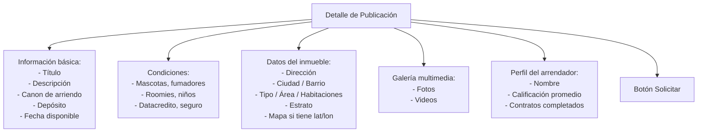
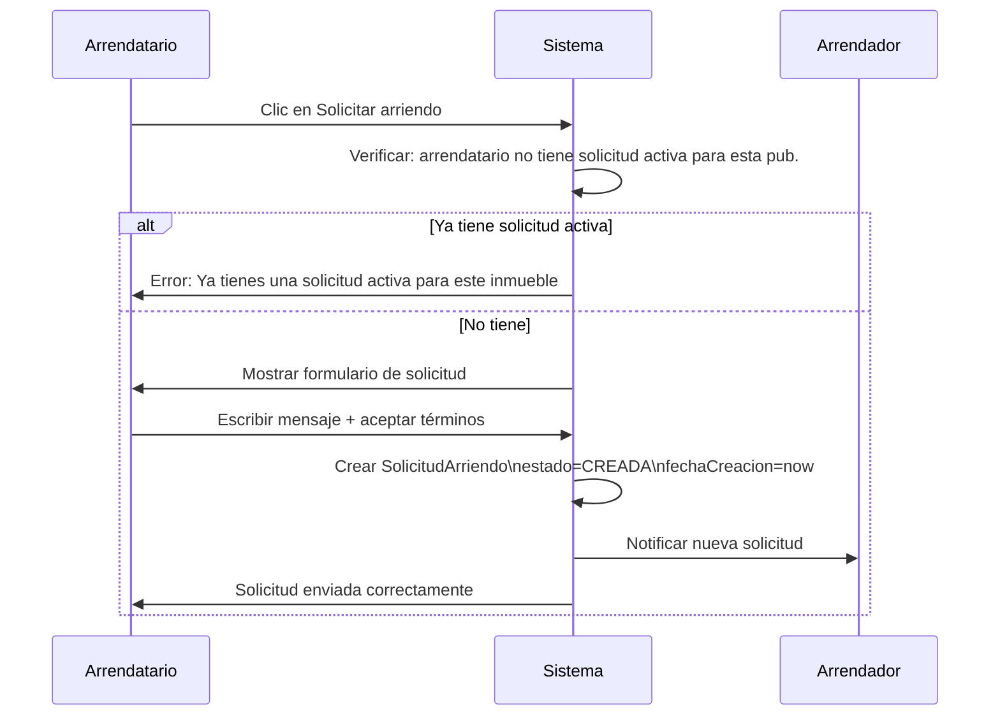
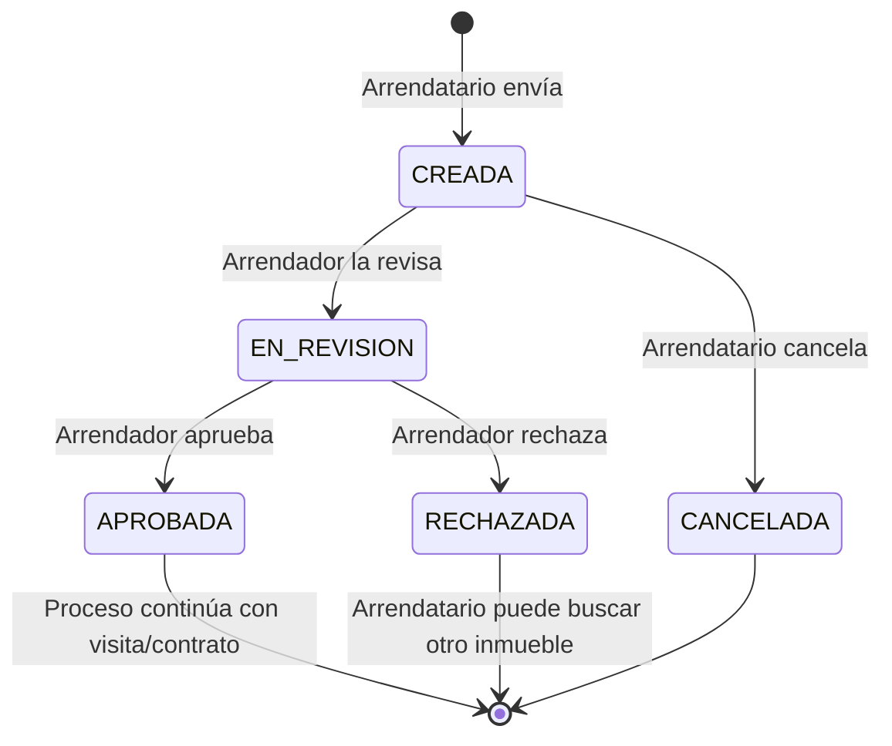
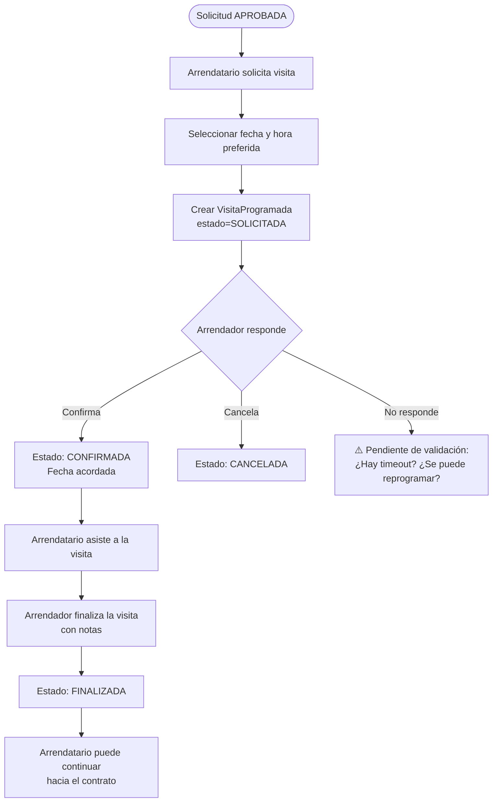
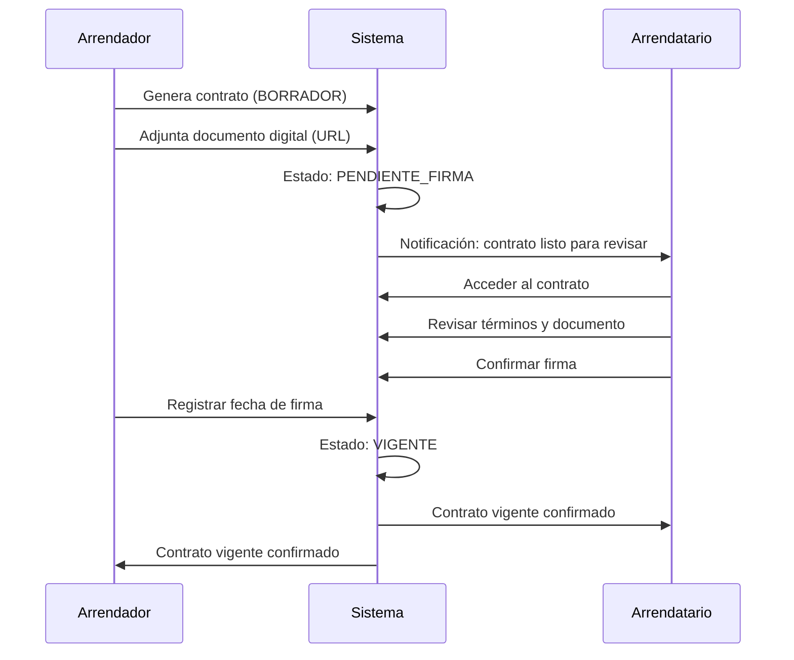
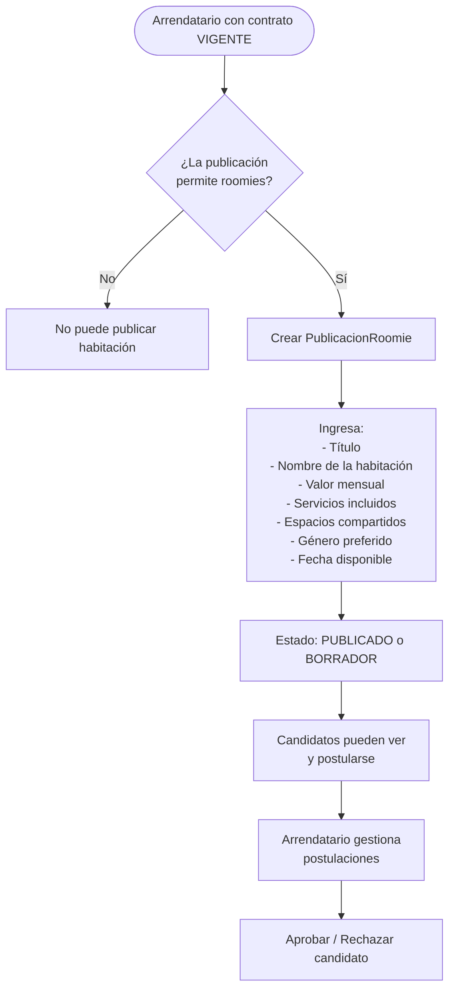

# 07 — Flujo del Arrendatario

## Descripción del rol

El arrendatario es el usuario que busca arrendar un inmueble. Puede buscar, filtrar, solicitar, visitar, firmar contratos y calificar arrendadores. También puede, una vez tenga un contrato vigente, publicar habitaciones para roomies si el inmueble lo permite.

---

## Flujo completo del arrendatario

---

## 1. Búsqueda de inmuebles

### Portal público vs. portal autenticado

> **Pendiente de validación:** ¿El portal React tiene una búsqueda funcional con filtros en tiempo real, o solo muestra el listado? ¿Está conectado al backend?

### Filtros de búsqueda disponibles

| Filtro | Tipo | Descripción |
|---|---|---|
| Ciudad | Texto/Select | Filtra por ciudad |
| Barrio | Texto | Filtra por barrio |
| Tipo de inmueble | Select | APARTAMENTO, CASA, HABITACION, etc. |
| Canon mínimo | Número | Precio mínimo mensual |
| Canon máximo | Número | Precio máximo mensual |
| Acepta mascotas | Boolean | Solo los que aceptan |
| Permite fumadores | Boolean | Solo los que permiten |
| Estrato | Rango | Del 1 al 6 |
| Fecha disponible | Fecha | Disponible antes de esta fecha |
| Permite roomies | Boolean | Solo los que lo permiten |

> **Pendiente de validación:** ¿Cuáles de estos filtros están implementados en el portal React actual? ¿La búsqueda es client-side o server-side?

---

## 2. Ver detalle de publicación

Al seleccionar una publicación, el arrendatario puede ver:

---

## 3. Enviar solicitud de arriendo

### Estados de una solicitud desde la perspectiva del arrendatario

---

## 4. Solicitar y asistir a visitas

> **Pendiente de validación:** ¿El arrendatario puede solicitar una visita sin que la solicitud esté en estado APROBADA? ¿O es requisito?

---

## 5. Firmar contrato

### Acceso al historial de contratos

El arrendatario puede ver todos sus contratos:
- Vigentes (en curso)
- Finalizados (historial)
- Cancelados (con razón)

---

## 6. Publicar habitación para roomie

Cuando el contrato está VIGENTE y la publicación del inmueble tiene `permiteRoomies = true`, el arrendatario puede publicar una habitación:

---

## 7. Calificaciones

Al finalizar el contrato, el arrendatario puede:

| Acción | Tipo | Descripción |
|---|---|---|
| Calificar al arrendador | `ARRENDATARIO_A_ARRENDADOR` | Puntaje 1-5 + comentario |
| Calificar a roomies | `ARRENDATARIO_A_ROOMIE` | Si tuvo roomies durante el contrato |

El arrendatario también puede ver su propia reputación:
- Promedio de calificaciones recibidas
- Historial de comentarios
- Contratos completados vs cancelados

---

## 8. Perfil del arrendatario

El `PerfilUsuario` del arrendatario contiene información relevante para los arrendadores:

| Campo | Relevancia para el arrendador |
|---|---|
| Nombre completo | Identificación |
| Tipo y número de documento | Verificación de identidad |
| Ciudad y barrio actual | Proximidad |
| Profesión / Ocupación | Estabilidad económica |
| Empresa / Universidad | Referencia laboral o académica |
| Tiene mascotas | Compatibilidad con el inmueble |
| Es fumador | Compatibilidad con el inmueble |
| Verified | Si el admin aprobó los documentos |
| Estado | ACTIVO, SUSPENDIDO, etc. |
| Calificaciones previas | Historial como inquilino |
| Habilitado como roomie | Si puede publicar habitaciones |

---

## 9. Notas de compatibilidad de convivencia

> **Pendiente de validación:** ¿El sistema debe implementar un sistema de compatibilidad automática entre los criterios del arrendatario y las condiciones del inmueble? Por ejemplo: si el arrendatario tiene mascotas, filtrar automáticamente solo los que `aceptaMascotas = true`.
