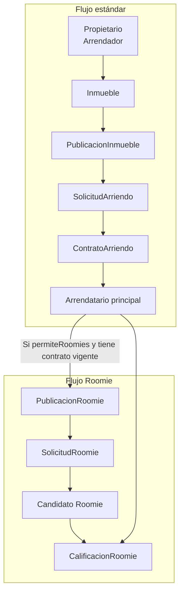
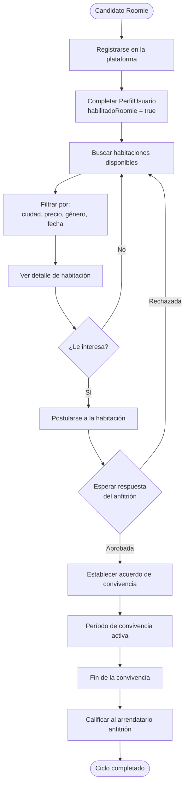
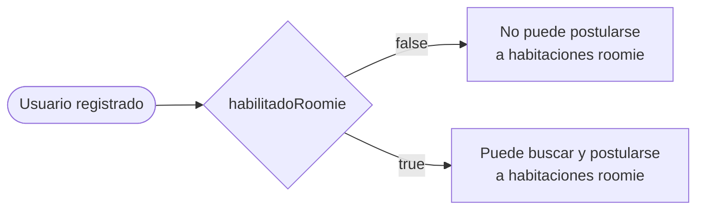
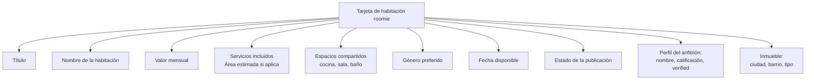
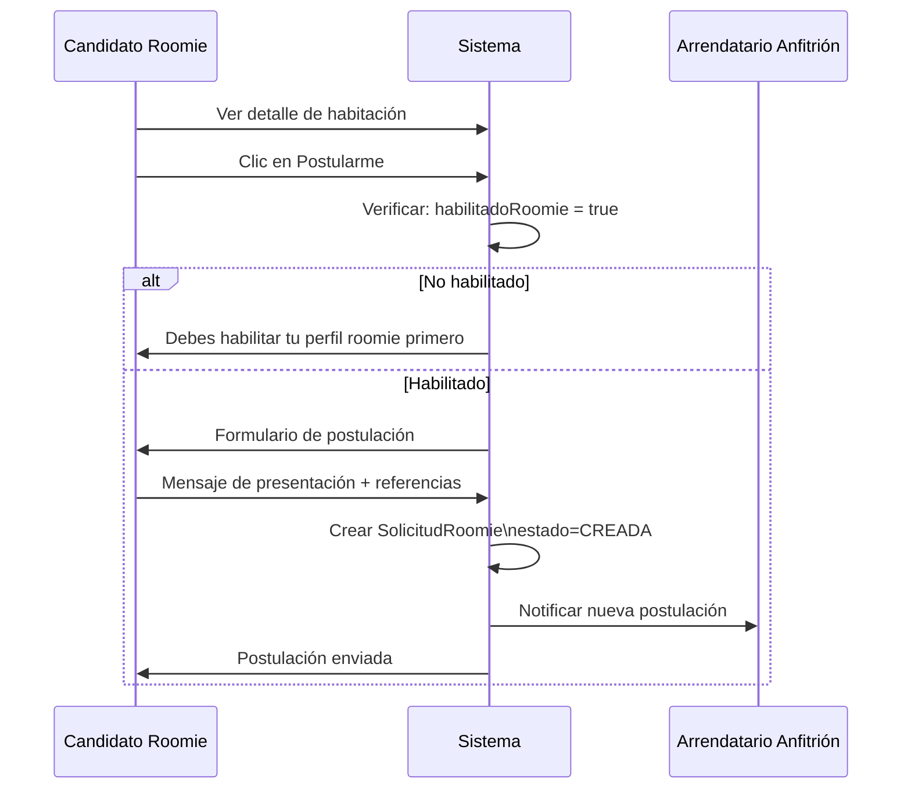
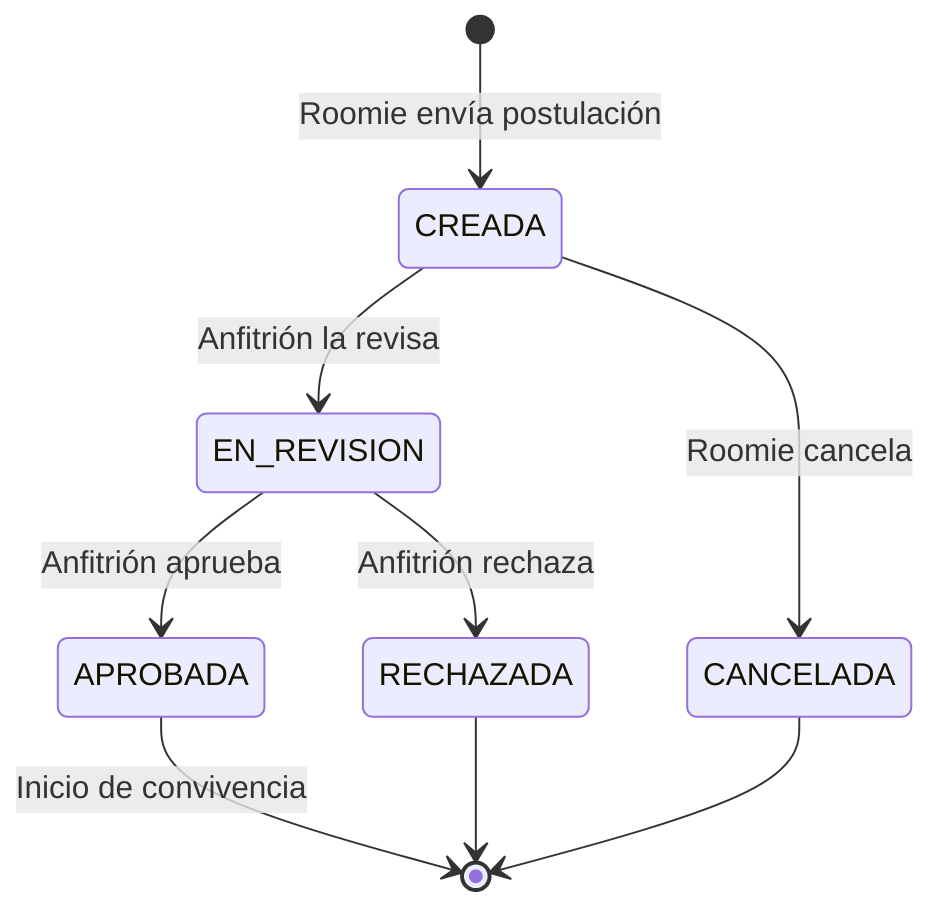
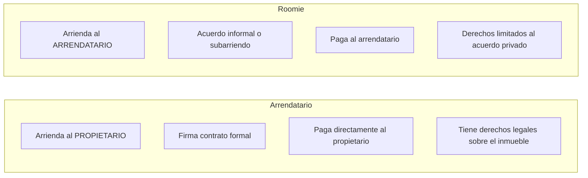

# 08 — Flujo del Roomie

## Descripción del rol

Un roomie es una persona que busca co-habitar en un espacio ya arrendado. No arrienda directamente al propietario sino que comparte con el arrendatario principal. El flujo del roomie es completamente independiente del flujo de arriendo estándar y opera sobre entidades propias (`PublicacionRoomie`, `SolicitudRoomie`).

---

## Diagrama de actores del flujo roomie

---

## Flujo completo del Roomie

---

## 1. Habilitación como Roomie

Para que un usuario pueda postularse como roomie, su perfil debe tener `habilitadoRoomie = true`. Este campo puede ser:

- **Activado por el propio usuario** al completar su perfil (pendiente de validación)
- **Activado por el administrador** tras verificar sus documentos

> **Pendiente de validación:** ¿Quién controla el campo `habilitadoRoomie`? ¿El propio usuario lo activa en su perfil, o requiere aprobación del admin? ¿Hay requisitos adicionales para activarlo?

---

## 2. Buscar y explorar habitaciones

El roomie accede al catálogo de publicaciones roomie. Cada publicación muestra:

### Filtros de búsqueda roomie

| Filtro | Descripción |
|---|---|
| Ciudad | Ubicación del inmueble |
| Precio máximo | Valor mensual máximo |
| Género preferido | MASCULINO, FEMENINO, OTRO, PREFIERO_NO_DECIR |
| Fecha disponible | Disponible antes de la fecha seleccionada |
| Acepta mascotas | Si el anfitrión lo permite |
| Permite fumadores | Si el anfitrión lo permite |

---

## 3. Proceso de postulación

### Estados de la postulación roomie

---

## 4. Campos de la solicitud roomie

| Campo | Descripción |
|---|---|
| Mensaje | Presentación personal del candidato |
| Referencias | Contactos o vínculos que respaldan al candidato |
| Estado | CREADA, EN_REVISION, APROBADA, RECHAZADA, CANCELADA |
| Fecha de creación | Registro automático |
| Postulante | Referencia al PerfilUsuario del candidato |
| PublicacionRoomie | Habitación a la que se postula |

---

## 5. Perfil del candidato roomie

El anfitrión puede revisar el perfil del candidato antes de aprobar. Los datos más relevantes son:

| Campo | Relevancia |
|---|---|
| Nombre completo | Identificación |
| Biografía | Descripción personal |
| Intereses | Compatibilidad de estilo de vida |
| Tiene mascotas | Compatibilidad |
| Fumador | Compatibilidad |
| Habilitado roomie | Indica que el perfil está activo como roomie |
| Calificaciones previas como roomie | Historial de convivencias anteriores |
| Verificado | Documentos aprobados por el admin |

---

## 6. Calificación al finalizar la convivencia

Al terminar la convivencia, ambas partes pueden calificarse:

| Acción | Actor | Tipo de calificación |
|---|---|---|
| Calificar al roomie | Arrendatario anfitrión | `ARRENDATARIO_A_ROOMIE` |
| Calificar al anfitrión | Candidato roomie | `ROOMIE_A_ARRENDATARIO` |

Ambas calificaciones incluyen:
- Puntaje: 1 a 5 estrellas
- Comentario: texto libre
- Vinculado al contrato correspondiente

> **Pendiente de validación:** Las calificaciones roomie actualmente están vinculadas a un `ContratoArriendo`. ¿Debería existir algún tipo de "acuerdo de convivencia" formal para los roomies (independiente del contrato principal del arrendatario)?

---

## 7. Restricciones del flujo roomie

- El roomie no puede postularse a la misma habitación dos veces simultáneamente.
- El roomie solo puede postularse a publicaciones en estado `PUBLICADO`.
- El roomie no puede ver datos de contacto directos del anfitrión hasta que la postulación esté APROBADA.
- La habitación roomie debe estar vinculada a un inmueble con contrato VIGENTE del anfitrión.

---

## 8. Diferencia clave: Roomie vs Arrendatario

> **Nota legal (pendiente de validación):** El subarriendo en Colombia requiere autorización explícita del propietario. El campo `permiteRoomies` en `PublicacionInmueble` intenta capturar esta autorización, pero deberían considerarse las implicaciones legales del modelo de roomie.
