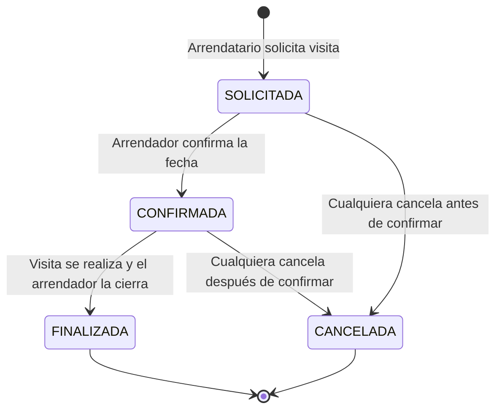
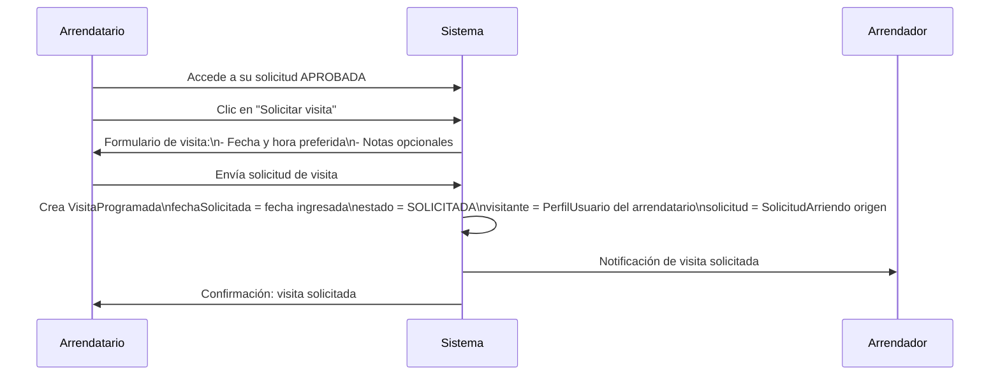
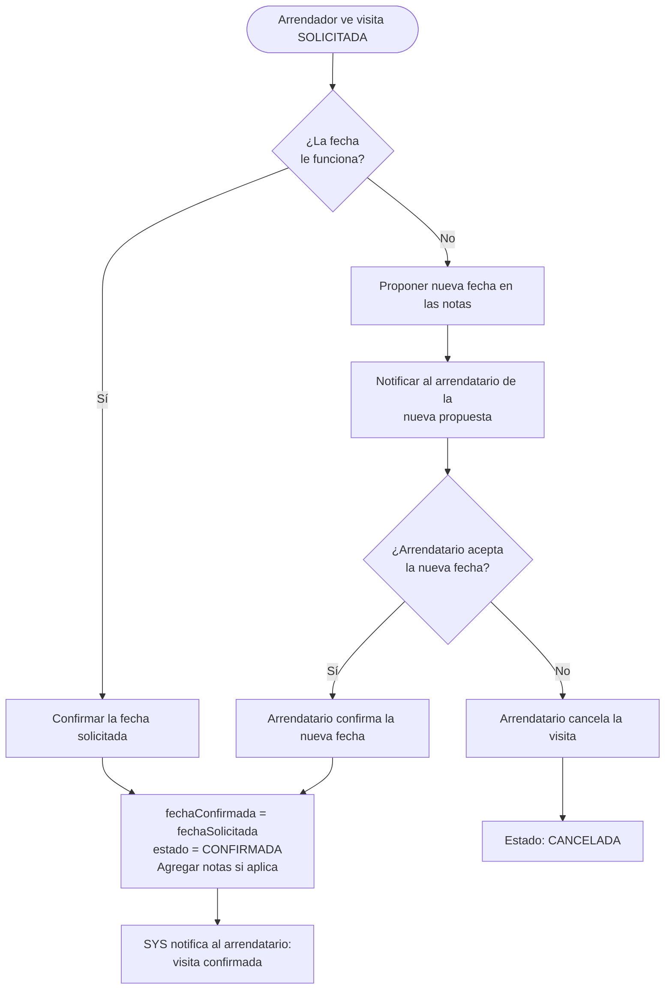
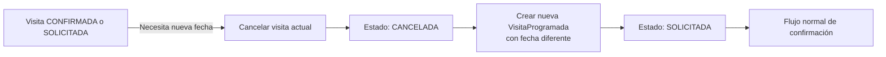
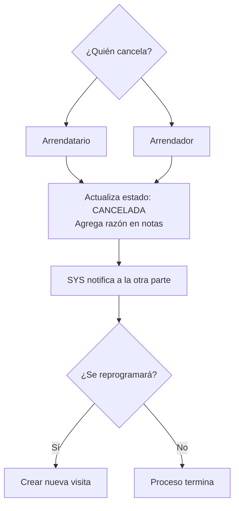
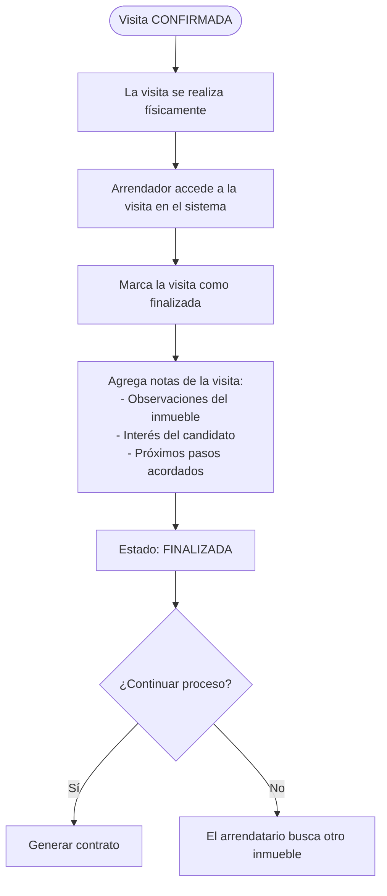

# 09 — Flujo de Visitas Programadas

## Descripción

Las visitas programadas (`VisitaProgramada`) son citas en las que un interesado visita físicamente el inmueble antes de tomar una decisión. El sistema estructura el proceso de agendamiento para evitar visitas perdidas, cancelaciones sin previo aviso y falta de información posterior.

---

## Ciclo de vida completo de una visita

---

## 1. Solicitud de visita

### Campos de una visita al solicitarla

| Campo | Valor inicial |
|---|---|
| `fechaSolicitada` | Fecha/hora propuesta por el arrendatario |
| `fechaConfirmada` | Vacío |
| `notas` | Opcional, texto libre |
| `estado` | `SOLICITADA` |
| `visitante` | PerfilUsuario del arrendatario |
| `solicitud` | SolicitudArriendo origen |

> **Pendiente de validación:** ¿La visita debe obligatoriamente estar vinculada a una `SolicitudArriendo`? ¿O puede el arrendador crear visitas directamente para prospectos que no han enviado solicitud formal?

---

## 2. Confirmación de visita

> **Pendiente de validación:** El flujo de "contra-propuesta de fecha" actualmente solo usa el campo `notas`. ¿Se requiere un campo `fechaPropuesta` separado del arrendador para que el flujo sea más claro?

---

## 3. Reprogramación de visita

El sistema actual no tiene un estado explícito de `REPROGRAMADA`. La reprogramación se maneja como:

1. Cancelar la visita actual (estado → CANCELADA)
2. Crear una nueva solicitud de visita con la nueva fecha

> **Pendiente de validación:** ¿Se debería agregar un estado `REPROGRAMADA` explícito en el modelo? Esto mantendría la trazabilidad sin crear registros huérfanos de visitas canceladas.

---

## 4. Cancelación de visita

Cualquiera de las partes puede cancelar:

---

## 5. Finalización de visita

---

## 6. Datos completos de una visita

| Campo | Tipo | Descripción |
|---|---|---|
| `id` | String (MongoDB ObjectId) | Identificador único |
| `fechaSolicitada` | Instant | Fecha/hora propuesta por el visitante |
| `fechaConfirmada` | Instant (nullable) | Fecha/hora acordada por el arrendador |
| `notas` | TextBlob (nullable) | Notas del arrendador sobre la visita |
| `estado` | EstadoVisita | SOLICITADA / CONFIRMADA / CANCELADA / FINALIZADA |
| `visitante` | → PerfilUsuario | Quien realiza la visita |
| `solicitud` | → SolicitudArriendo | Solicitud de arriendo origen |

---

## 7. Reglas de negocio de visitas

| Regla | Descripción |
|---|---|
| Una visita por solicitud | Cada solicitud puede tener múltiples visitas (si la primera se cancela) |
| Visita requiere solicitud | La visita debe estar vinculada a una SolicitudArriendo |
| Solo el arrendador puede finalizar | El estado FINALIZADA lo controla el arrendador |
| Cancelación libre | Cualquiera puede cancelar en cualquier momento |
| Notas son auditables | El campo de notas queda en el historial del sistema |

> **Pendiente de validación:** ¿El sistema debe enviar recordatorios automáticos (correo/notificación) el día antes de la visita confirmada?

---

## 8. Resumen del estado desde cada perspectiva

### Perspectiva del arrendatario

| Estado | Significado para mí |
|---|---|
| SOLICITADA | Esperando que el arrendador confirme |
| CONFIRMADA | La visita está agendada, debo asistir |
| CANCELADA | La visita no se realizará |
| FINALIZADA | La visita ya ocurrió |

### Perspectiva del arrendador

| Estado | Acción requerida |
|---|---|
| SOLICITADA | Confirmar o proponer nueva fecha |
| CONFIRMADA | Preparar el inmueble para la visita |
| CANCELADA | No hay acción requerida |
| FINALIZADA | El proceso puede continuar hacia el contrato |
