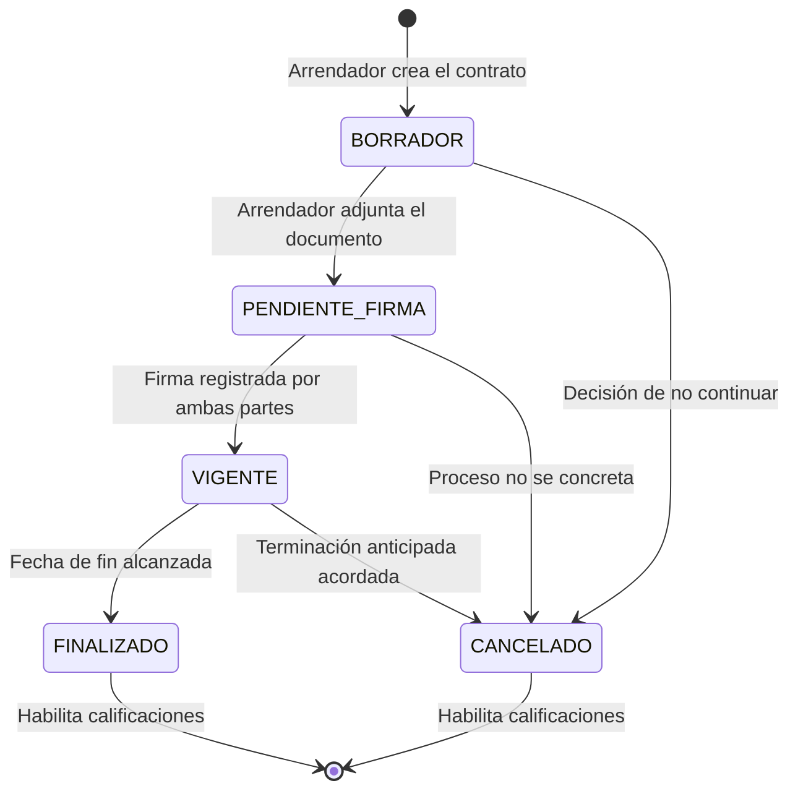
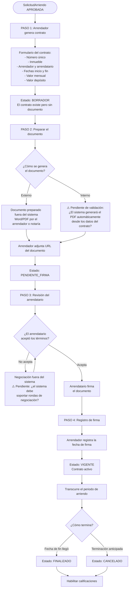
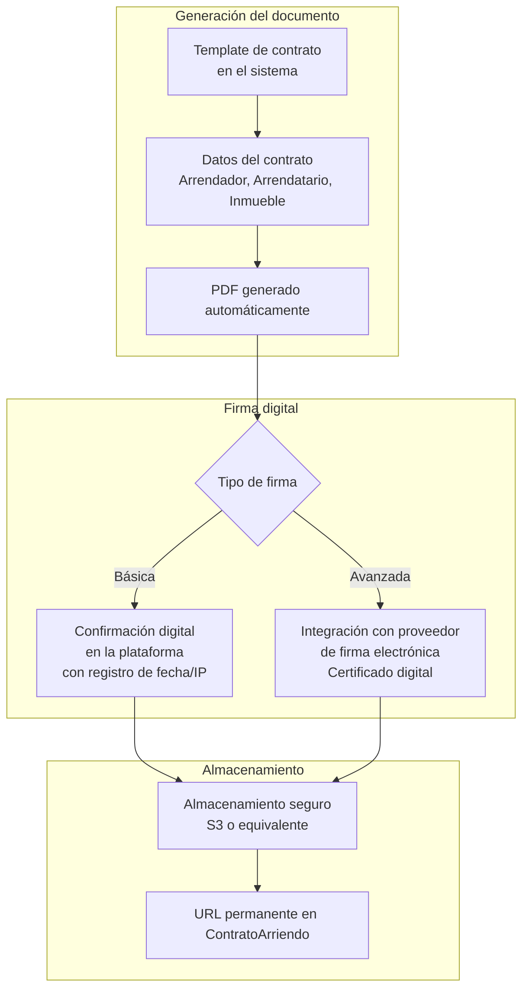
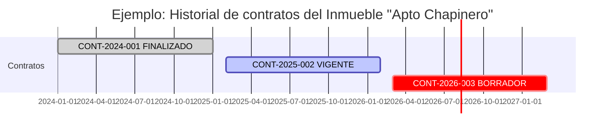
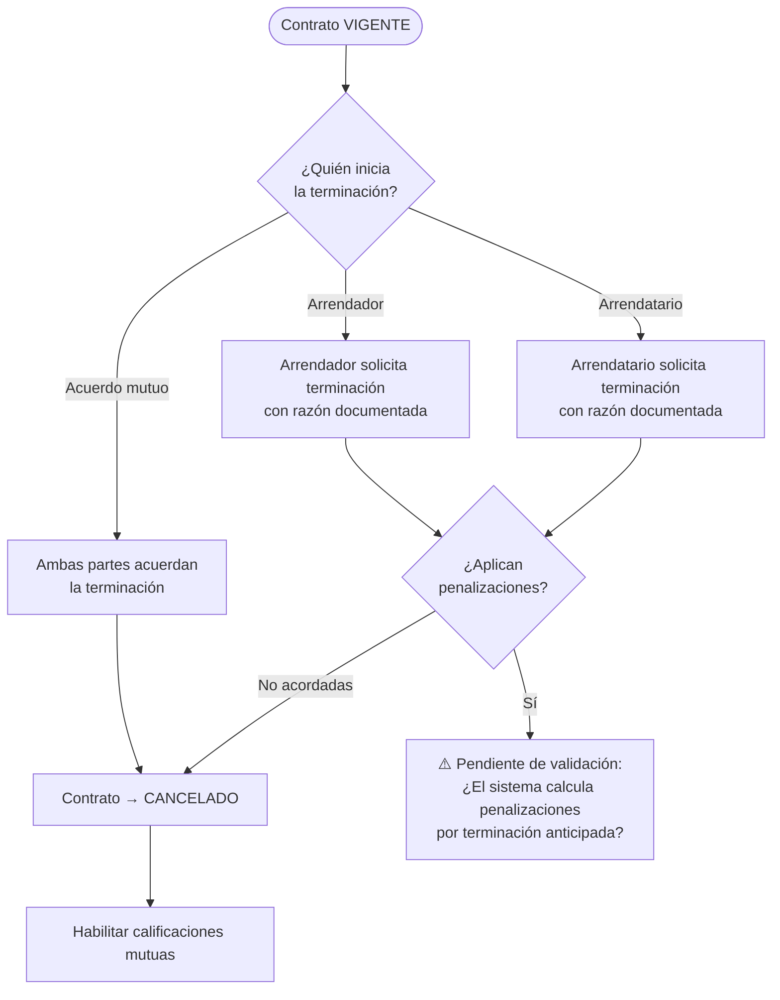
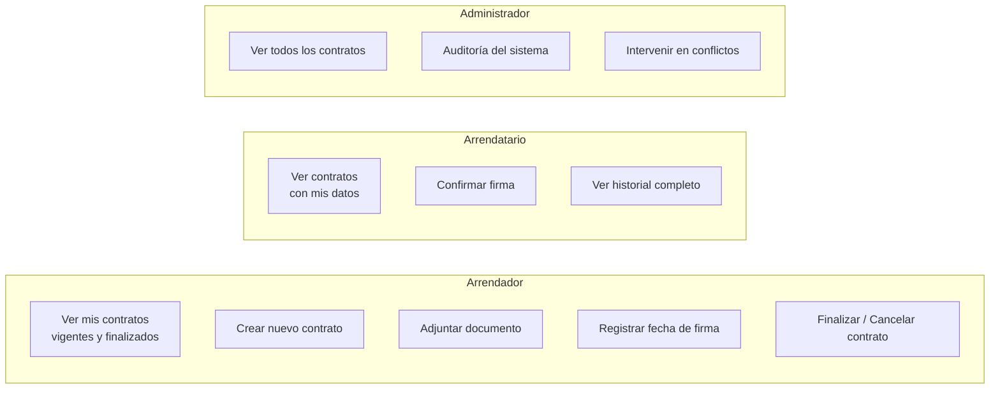

# 10 — Contratos Digitales

## Visión

El contrato digital es el eje central del modelo de negocio. La visión de RoomRent es **eliminar completamente el papel** del proceso de arrendamiento. Esto implica:

1. Generar contratos desde la plataforma
2. Adjuntar el documento en formato digital
3. Registrar la firma de ambas partes
4. Mantener el historial completo y accesible en todo momento
5. Vincular el contrato con el inmueble, el arrendador y el arrendatario

---

## Ciclo de vida del contrato

---

## Flujo completo de un contrato

---

## Datos del contrato

| Campo | Tipo | Requerido | Descripción |
|---|---|---|---|
| `numeroContrato` | String (único) | Sí | Identificador del contrato. Formato sugerido: `CONT-YYYY-NNN` |
| `urlContratoDigital` | String | No | URL al documento firmado |
| `fechaInicio` | LocalDate | Sí | Inicio del periodo de arriendo |
| `fechaFin` | LocalDate | Sí | Fin del periodo acordado |
| `valorMensual` | Long | Sí | Canon mensual en pesos colombianos |
| `valorDeposito` | Long | No | Monto del depósito (usualmente 1-3 meses) |
| `estado` | EstadoContrato | Sí | Ver ciclo de vida |
| `fechaFirma` | Instant | No | Fecha y hora de firma del documento |
| `arrendador` | → PerfilUsuario | Sí | Quién arrienda el inmueble |
| `arrendatario` | → PerfilUsuario | Sí | Quién toma en arriendo |
| `inmueble` | → Inmueble | Sí | El inmueble arrendado |

---

## Diseño del contrato digital

### Visión actual (implementada)

El sistema registra la URL de un documento externo. El documento en sí se genera y firma fuera del sistema (Word, PDF enviado por correo, etc.), y la URL queda como referencia.

### Visión futura (propuesta, sin implementar)

> **Pendiente de validación:** La firma electrónica con validez legal en Colombia requiere un certificado digital emitido por una entidad certificadora autorizada. ¿La plataforma debe integrar un proveedor de firma electrónica? Si no, ¿cuál es el valor legal del contrato digital generado?

---

## Historial de contratos por inmueble

Un inmueble puede tener múltiples contratos a lo largo del tiempo (rearrendamientos sucesivos):

El sistema permite ver el historial completo de contratos de un inmueble:
- Contratos pasados (FINALIZADO, CANCELADO)
- Contrato actual (VIGENTE)
- Contratos futuros (BORRADOR, PENDIENTE_FIRMA)

---

## Terminación anticipada del contrato

> **Pendiente de validación:** ¿El sistema debe soportar el cálculo de penalizaciones por terminación anticipada según las leyes colombianas de arriendo (Ley 820 de 2003)?

---

## Reglas de negocio del contrato

| Regla | Descripción |
|---|---|
| Número único | `numeroContrato` debe ser único en toda la base de datos |
| Un contrato vigente por inmueble | El inmueble no debería tener dos contratos VIGENTES simultáneamente |
| Arrendador ≠ Arrendatario | No se puede contratar consigo mismo |
| Fecha fin > Fecha inicio | Validación básica de fechas |
| VIGENTE antes de calificar | Solo contratos FINALIZADO o CANCELADO habilitan calificaciones |

---

## Perspectiva de cada actor sobre el contrato

