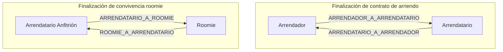
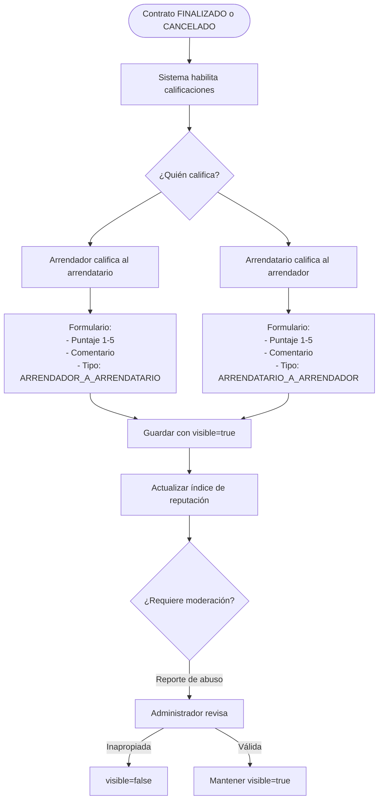
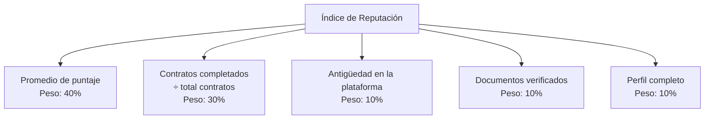
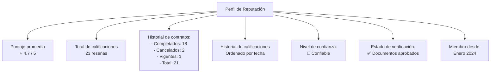
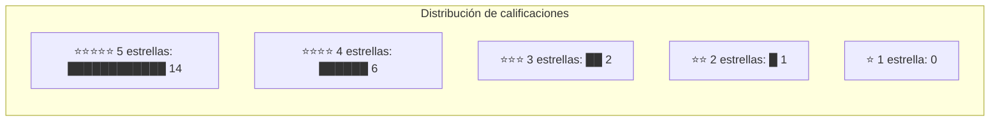
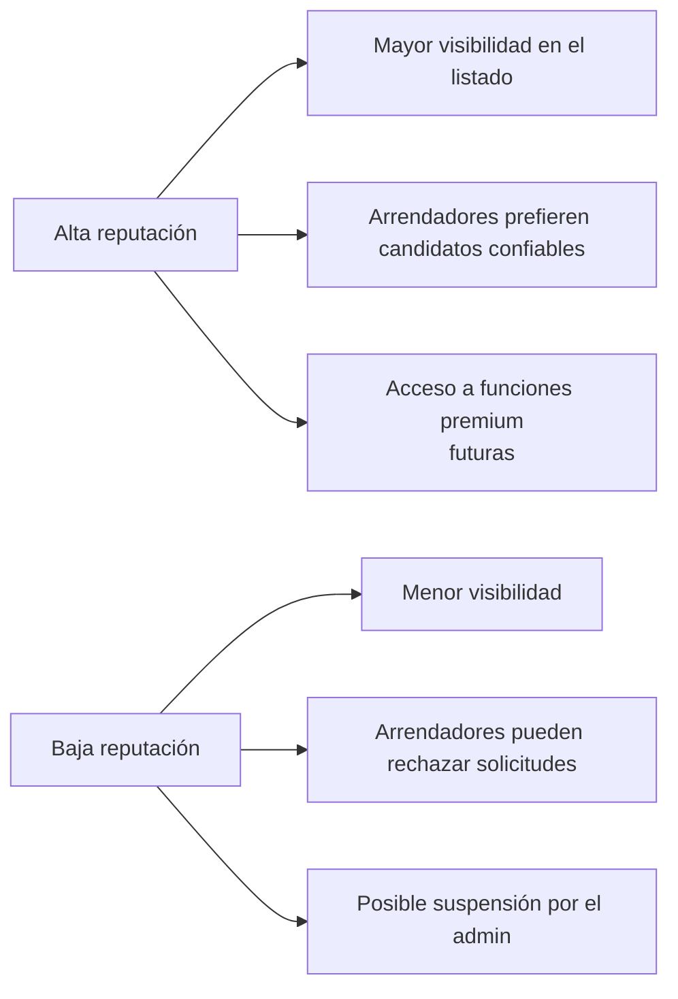
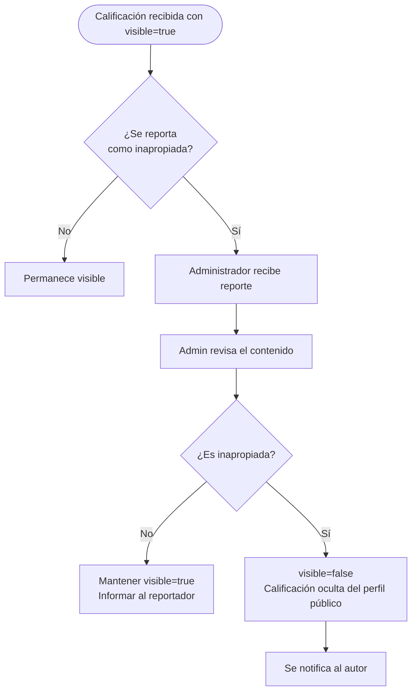

# 11 — Sistema de Reputación y Calificaciones

## Visión

El sistema de reputación va más allá de las estrellas. RoomRent construye un perfil de confianza para cada usuario basado en su historial real de contratos: cuántos completó, cuántos canceló, qué dijeron las otras partes, y cuánto tiempo lleva activo en la plataforma.

La reputación es un activo del usuario que se construye a lo largo del tiempo y no puede reiniciarse.

---

## Actores y tipos de calificación



---

## Estructura de una calificación

| Campo | Tipo | Descripción |
|---|---|---|
| `tipoCalificacion` | TipoCalificacion | Quién califica a quién |
| `puntaje` | Integer (1-5) | Puntuación numérica |
| `comentario` | TextBlob | Texto libre con la experiencia |
| `fechaCreacion` | Instant | Cuándo se emitió |
| `visible` | Boolean | Si es pública o fue moderada |
| `autor` | → PerfilUsuario | Quien emite la calificación |
| `calificado` | → PerfilUsuario | Quien la recibe |
| `contrato` | → ContratoArriendo | El contrato que origina la calificación |

---

## Flujo de calificación



---

## Índice de reputación propuesto

El índice de reputación es un número compuesto que va más allá del promedio de estrellas.

### Componentes del índice



> **Pendiente de validación:** Este cálculo de índice compuesto no está implementado. Se propone para una versión futura. ¿Se aprueba este modelo de ponderación? ¿Hay otros factores a incluir?

### Niveles de confianza (propuesta)

| Nivel | Condición | Insignia |
|---|---|---|
| **Nuevo** | Menos de 2 contratos | Sin insignia |
| **Confiable** | 2+ contratos, puntaje ≥ 4.0 | 🔵 |
| **Verificado** | Documentos aprobados + 3+ contratos | ✅ |
| **Experimentado** | 5+ contratos, puntaje ≥ 4.5 | ⭐ |
| **Premium** | 10+ contratos, puntaje ≥ 4.8, nunca cancelado | 🏆 |

---

## Perfil de reputación de un usuario

El perfil público de cualquier usuario autenticado mostrará:



### Distribución de puntajes (histograma)



---

## Calificaciones visibles en el perfil

Cada calificación en el historial público muestra:

```
━━━━━━━━━━━━━━━━━━━━━━━━━━━━━━━━
⭐⭐⭐⭐⭐  Enero 2026
Calificado por: Carlos R. (Arrendador)

"Excelente inquilino, muy puntual con los pagos y 
cuidadoso con el inmueble. Totalmente recomendado."

Contrato: CONT-2025-001
Inmueble: Apto Chapinero Alto
━━━━━━━━━━━━━━━━━━━━━━━━━━━━━━━━
```

---

## Reglas de negocio del sistema de reputación

| Regla | Descripción |
|---|---|
| Solo al cerrar contrato | No se puede calificar si el contrato sigue VIGENTE |
| Una calificación por contrato por dirección | El arrendador califica al arrendatario una sola vez por contrato |
| Calificación bidireccional | Ambas partes pueden calificar; ninguna puede obligar a la otra |
| Plazo de calificación | ⚠️ **Pendiente de validación:** ¿Cuántos días después del cierre del contrato puede calificarse? |
| Moderación | El administrador puede ocultar (`visible=false`) calificaciones inapropiadas |
| No anonimato | La calificación siempre identifica al autor |
| Historial permanente | Las calificaciones no se eliminan; solo se ocultan si son inapropiadas |

---

## Impacto de la reputación en el sistema



---

## Tipos de calificación: resumen completo

| TipoCalificacion | Quién | A quién | Contexto |
|---|---|---|---|
| `ARRENDADOR_A_ARRENDATARIO` | Arrendador | Arrendatario | Al cierre de ContratoArriendo |
| `ARRENDATARIO_A_ARRENDADOR` | Arrendatario | Arrendador | Al cierre de ContratoArriendo |
| `ARRENDATARIO_A_ROOMIE` | Arrendatario (anfitrión) | Roomie | Al cierre de convivencia roomie |
| `ROOMIE_A_ARRENDATARIO` | Roomie | Arrendatario (anfitrión) | Al cierre de convivencia roomie |

---

## Moderación por el administrador



> **Pendiente de validación:** ¿El sistema debe implementar un mecanismo de reporte de calificaciones? Actualmente solo el administrador puede cambiar `visible` manualmente.
