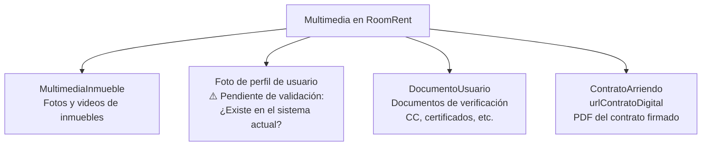
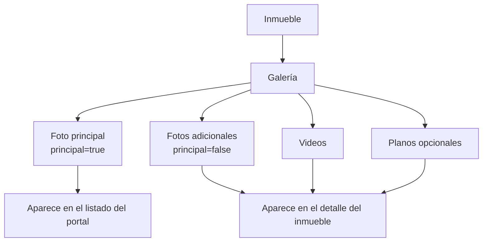
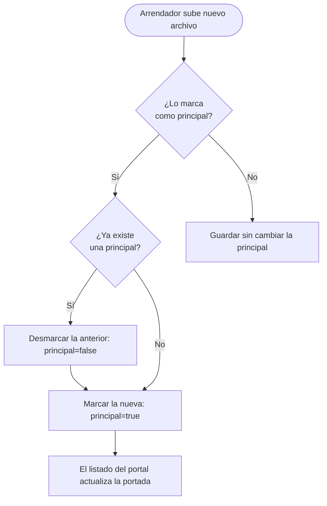
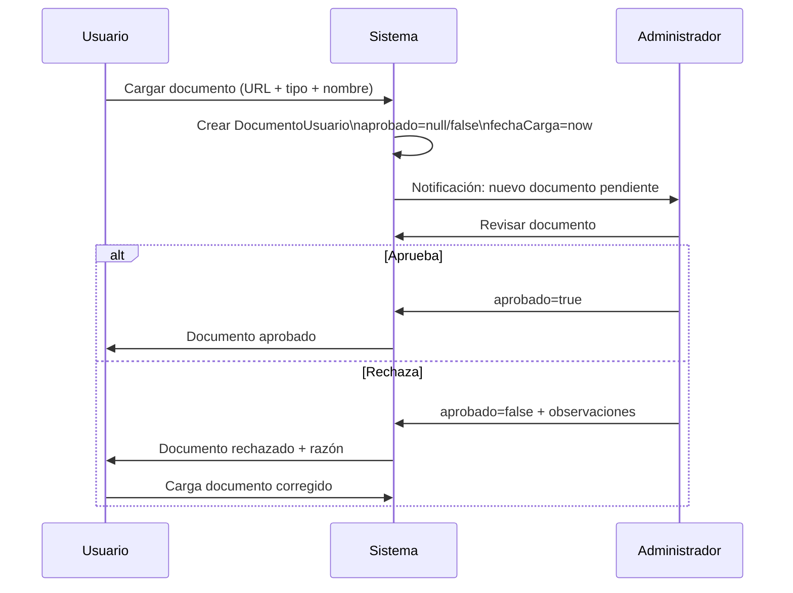
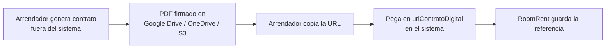
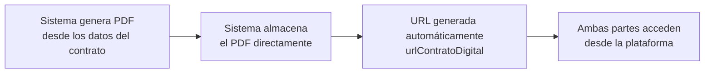
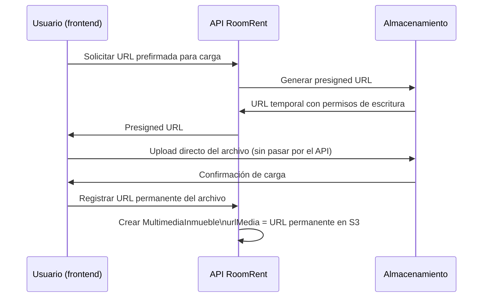

# 12 — Gestión de Multimedia

## Descripción

El sistema de multimedia gestiona todos los archivos digitales asociados a los actores y entidades del sistema. Actualmente, el modelo principal es `MultimediaInmueble`, que almacena referencias (URLs) a archivos externos. El sistema en su estado actual **no gestiona la carga directa de archivos** — almacena URLs.

---

## Tipos de multimedia en el sistema

---

## 1. Multimedia del Inmueble (MultimediaInmueble)

### Estructura actual

| Campo | Tipo | Descripción |
|---|---|---|
| `urlMedia` | String (required) | URL del archivo en almacenamiento externo |
| `tipoMedia` | String (required) | MIME type del archivo |
| `principal` | Boolean (required) | Si es la imagen de portada del inmueble |
| `titulo` | String (nullable) | Descripción breve del archivo |
| `inmueble` | → Inmueble | El inmueble al que pertenece |

### Galería de un inmueble

### Tipos de media soportados

| Tipo | tipoMedia | Uso |
|---|---|---|
| Foto | `image/jpeg`, `image/png`, `image/webp` | Fotos interiores y exteriores |
| Video | `video/mp4`, `video/webm` | Recorrido virtual |
| Plano | `image/png`, `application/pdf` | Plano arquitectónico |

### Reglas de la foto principal

---

## 2. Documentos de usuario (DocumentoUsuario)

Los documentos de verificación son archivos que el usuario carga para que el administrador los valide.

### Estructura actual

| Campo | Tipo | Descripción |
|---|---|---|
| `tipoDocumento` | TipoDocumento | CC, CE, TI, PASSPORT, NIT, OTRO |
| `nombreDocumento` | String | Nombre descriptivo del archivo |
| `urlArchivo` | String | URL del archivo |
| `tipoMime` | String | Tipo del archivo |
| `tamanoArchivo` | Long | Tamaño en bytes |
| `fechaCarga` | Instant | Cuándo se cargó |
| `aprobado` | Boolean | Si el admin lo aprobó |
| `observaciones` | TextBlob | Notas del admin al rechazar |
| `perfilUsuario` | → PerfilUsuario | El dueño del documento |

### Flujo de un documento de verificación

### Documentos requeridos para verificación

> **Pendiente de validación:** ¿Cuáles son los documentos obligatorios para que un usuario quede `verificado=true`? ¿El sistema debe definir una lista de documentos requeridos por tipo de usuario?

Propuesta:

| Tipo de usuario | Documentos sugeridos |
|---|---|
| Arrendatario | CC o CE, Carta laboral, Último desprendible de pago |
| Arrendador | CC o CE, Escrituras del inmueble (o poder notarial) |
| Roomie | CC o CE, Carta de referencia |

---

## 3. URL de contrato digital (ContratoArriendo.urlContratoDigital)

El contrato digital es el PDF firmado del contrato de arrendamiento.

### Estado actual

El sistema almacena la URL del contrato en el campo `urlContratoDigital` de `ContratoArriendo`. El archivo no es gestionado directamente por RoomRent — se asume que está alojado en un servicio externo.

### Flujo actual

### Visión futura

---

## 4. Diseño funcional del sistema de almacenamiento (propuesta futura)

> Esta sección es un diseño propuesto, no implementado.

### Opciones de almacenamiento

| Opción | Ventajas | Desventajas |
|---|---|---|
| **AWS S3** | Escalable, CDN disponible, SDK maduro | Costo por uso, dependencia de AWS |
| **Cloudinary** | Transformaciones de imagen, CDN | Costo por uso |
| **MinIO** | Self-hosted, compatible S3 | Requiere infraestructura propia |
| **Google Cloud Storage** | Integración con GCP | Dependencia de Google |

### Flujo de carga propuesto

---

## 5. Foto de perfil de usuario

> **Pendiente de validación:** El sistema actual (`PerfilUsuario`) no tiene un campo de foto de perfil. ¿Se implementará como:
> - Un campo `urlFotoPerfil: String` en `PerfilUsuario`?
> - Un `DocumentoUsuario` de tipo especial?
> - Un servicio externo (Gravatar)?

### Propuesta de implementación

Agregar campo `urlFotoPerfil: String` a `PerfilUsuario`. La foto sería gestionada por el mismo sistema de almacenamiento que las fotos de inmueble.

---

## 6. Resumen de capacidades de multimedia por actor

| Actor | Fotos inmueble | Videos inmueble | Documentos verificación | Foto perfil | PDF contrato |
|---|---|---|---|---|---|
| Arrendador | ✅ Gestiona | ✅ Gestiona | ✅ Carga propios | ⚠️ Pendiente | ✅ Adjunta URL |
| Arrendatario | — | — | ✅ Carga propios | ⚠️ Pendiente | 👁️ Solo lectura |
| Roomie | — | — | ✅ Carga propios | ⚠️ Pendiente | — |
| Administrador | 👁️ Todo | 👁️ Todo | ✅ Aprueba/rechaza | 👁️ Ve todos | 👁️ Ve todos |
| Visitante | 👁️ Galería pública | 👁️ Galería pública | — | — | — |
