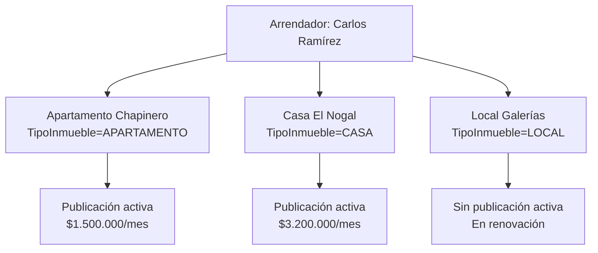
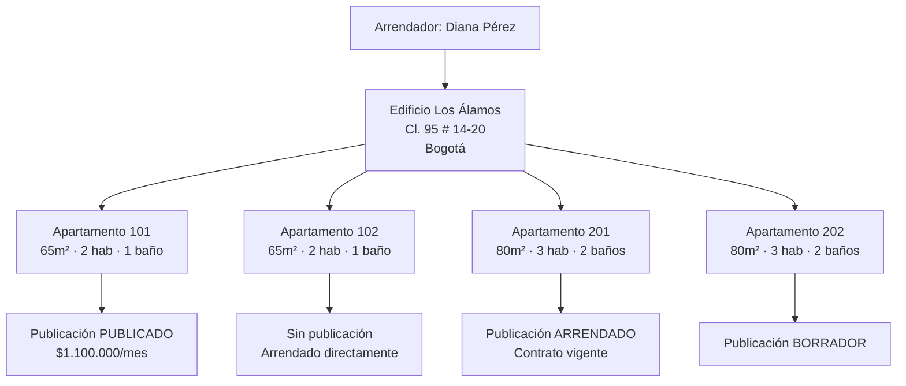
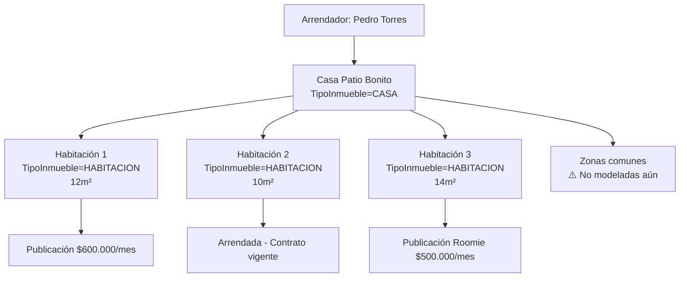
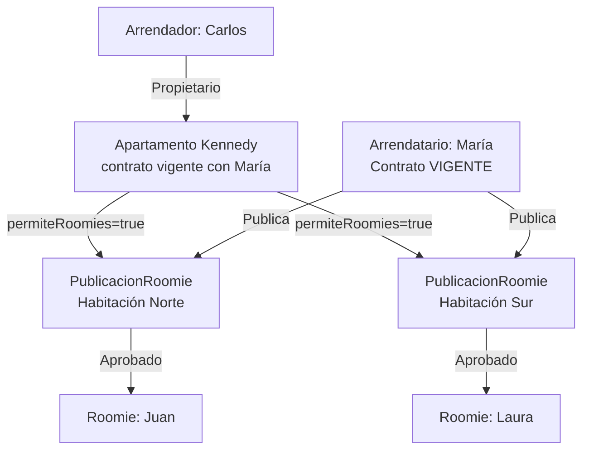
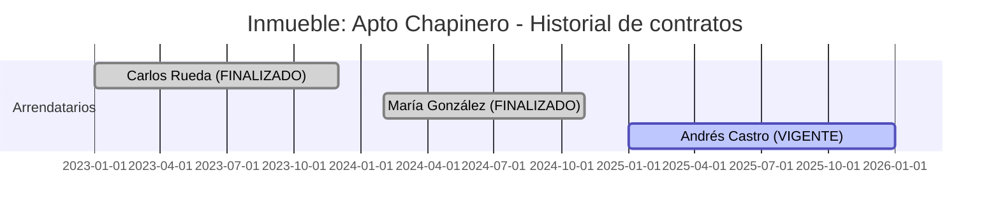
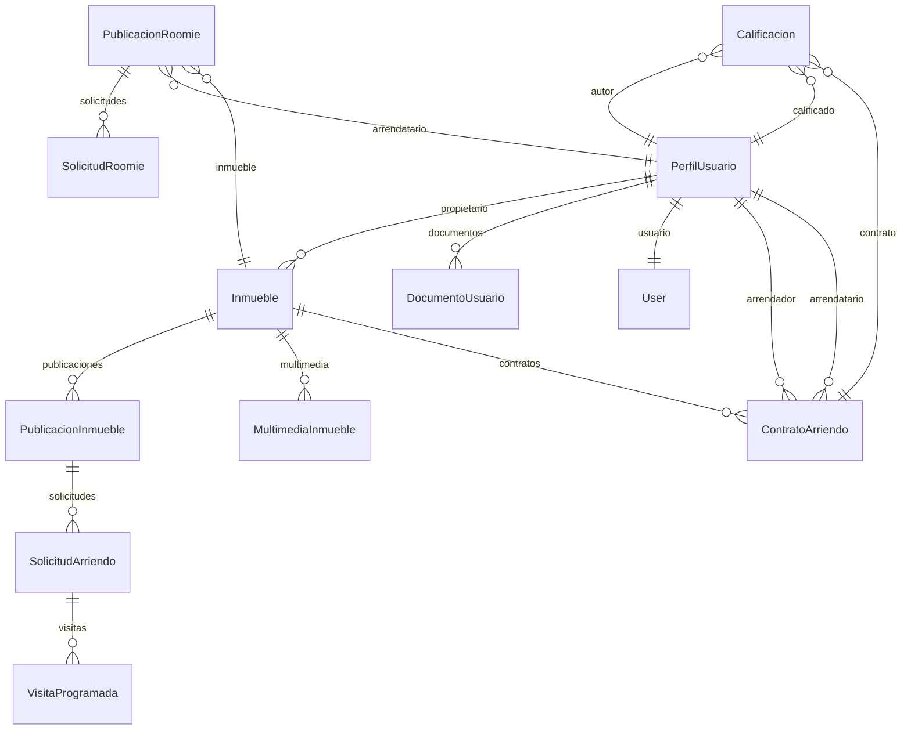
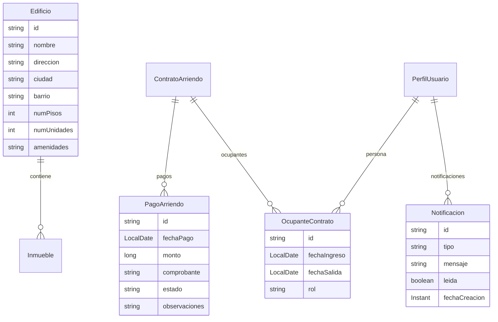

# 13 — Modelo de Negocio

## Visión del dominio

RoomRent debe soportar múltiples escenarios de arrendamiento que van desde la habitación individual hasta el edificio completo con decenas de unidades. Cada unidad debe poder administrarse de forma completamente independiente: su propia publicación, su propio contrato, sus propios inquilinos, su propia multimedia y su propio historial.

---

## Escenarios soportados

### Escenario 1: Arrendador con múltiples inmuebles independientes

**Estado actual:** ✅ Completamente soportado. `PerfilUsuario → OneToMany → Inmueble`.

---

### Escenario 2: Edificio con múltiples unidades

**Estado actual:** ⚠️ **Parcialmente soportado.** Cada apartamento es un `Inmueble` independiente. No existe una entidad `Edificio` que los agrupe. El arrendador debe registrar 4 `Inmueble`s separados, sin relación entre ellos.

**Problema:** No es posible ver "todos los apartamentos de este edificio" como grupo, ni gestionar características comunes del edificio (portería, ascensor, zonas comunes, parqueaderos del edificio).

---

### Escenario 3: Casa con habitaciones independientes

**Estado actual:** ⚠️ **Parcialmente soportado.** Se pueden registrar 3 `Inmueble`s de tipo HABITACION independientes. No existe una entidad que represente la "casa" como contenedor de esas habitaciones. El arrendador maneja 3 inmuebles sin relación explícita entre ellos.

---

### Escenario 4: Apartamento con arrendatario principal y roomies

**Estado actual:** ✅ **Completamente soportado.** `PublicacionRoomie` vincula el inmueble con la publicación del arrendatario. Cada roomie tiene su `SolicitudRoomie` independiente.

---

### Escenario 5: Múltiples contratos en el tiempo (rearrendamiento)

**Estado actual:** ✅ **Completamente soportado.** `Inmueble → OneToMany → ContratoArriendo`. El historial completo se conserva.

---

## Análisis del modelo actual vs. el modelo ideal

### Modelo actual (implementado)

### Modelo extendido propuesto (no implementado)

Las siguientes entidades se proponen para versiones futuras:

---

## Gaps identificados en el modelo actual

| Gap | Descripción | Impacto | Propuesta |
|---|---|---|---|
| **Sin entidad Edificio** | No se pueden agrupar unidades del mismo edificio | Medio | Agregar `Edificio → OneToMany → Inmueble` |
| **Sin tracking de pagos** | No hay registro de pagos mensuales | Alto | Agregar `PagoArriendo → ManyToOne → ContratoArriendo` |
| **Un solo arrendatario por contrato** | No soporta múltiples titulares en el mismo contrato | Medio | Agregar `OcupanteContrato` como tabla intermedia |
| **Sin notificaciones** | No hay sistema in-app de alertas | Alto | Agregar `Notificacion → ManyToOne → PerfilUsuario` |
| **Sin foto de perfil** | `PerfilUsuario` no tiene campo de imagen | Bajo | Agregar `urlFotoPerfil: String` a `PerfilUsuario` |
| **Sin subarriendo formal** | El roomie no tiene un "contrato" propio | Medio | Definir si SolicitudRoomie aprobada debe generar un acuerdo formal |
| **Sin zonas comunes** | No se modelan amenidades o espacios compartidos del edificio | Bajo | Parte de la futura entidad `Edificio` |
| **Sin penalizaciones** | No hay cálculo de multas por terminación anticipada | Bajo | Campo o entidad `PenalizacionContrato` |

---

## Principios del modelo de negocio

1. **Cada unidad es independiente.** Una habitación, un apartamento, un local — cada uno tiene su propio ciclo de vida completo (publicación, contrato, multimedia, historial).

2. **Un inmueble puede tener múltiples contratos en el tiempo**, pero solo uno vigente simultáneamente.

3. **El arrendador es siempre el propietario** (o su representante autorizado) del inmueble.

4. **El roomie no tiene relación directa con el propietario** — su relación es con el arrendatario principal.

5. **La reputación es permanente.** Las calificaciones no se eliminan y reflejan el comportamiento histórico real.

6. **El contrato es la fuente de verdad.** Solicitudes, visitas y calificaciones giran alrededor del contrato.
