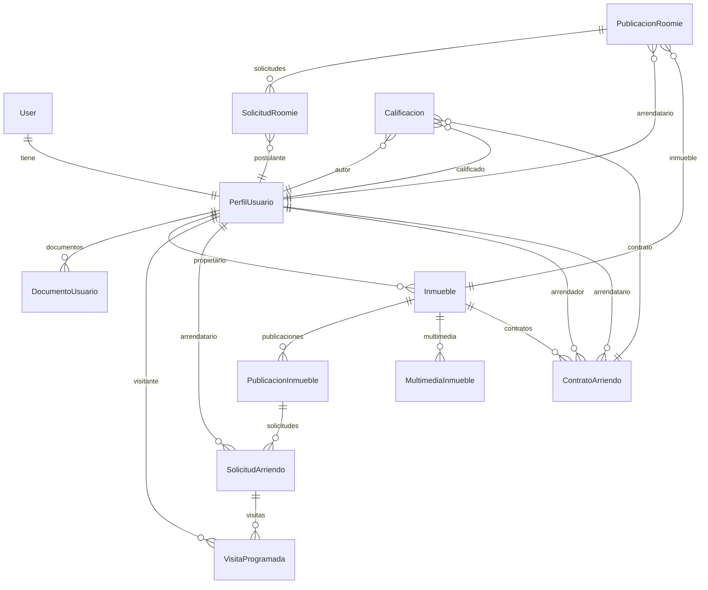

# 14 — Análisis de Entidades

## Mapa de relaciones completo

---

## User (entidad de JHipster — builtIn)

**Representa:** La cuenta de acceso al sistema. Gestionada completamente por JHipster.

| Campo | Tipo | Descripción |
|---|---|---|
| `id` | String | Identificador único |
| `login` | String | Nombre de usuario |
| `email` | String | Correo electrónico |
| `password_hash` | String | Contraseña encriptada |
| `first_name`, `last_name` | String | Nombre básico |
| `activated` | Boolean | Si la cuenta está activa |
| `lang_key` | String | Idioma preferido |
| `created_date`, `last_modified_date` | Instant | Auditoría |
| `authorities` | Set\<Authority\> | Roles del usuario |

**Colección MongoDB:** `jhi_user`

**Relación con el negocio:**
- Cada `User` tiene exactamente un `PerfilUsuario` (relación `OneToOne`)
- El `User` gestiona el acceso; el `PerfilUsuario` gestiona el perfil de negocio

**Posibles mejoras:**
- Sin cambios necesarios. El `User` de JHipster es suficiente para autenticación.

---

## PerfilUsuario

**Representa:** El perfil extendido de negocio de cada usuario. Contiene toda la información personal, laboral y de convivencia.

**Colección MongoDB:** `perfil_usuario`

| Grupo | Campos | Descripción |
|---|---|---|
| Identidad | `tipoDocumento`, `numeroDocumento` | Documento oficial de identidad |
| Nombre | `primerNombre`, `segundoNombre`, `primerApellido`, `segundoApellido` | Nombre completo |
| Personal | `fechaNacimiento`, `genero` | Datos personales básicos |
| Contacto | `telefono`, `direccionActual`, `ciudad`, `barrio` | Cómo y dónde ubicar al usuario |
| Laboral | `profesion`, `ocupacion`, `empresaTrabajo`, `universidad` | Referencia de solvencia económica |
| Convivencia | `tieneMascotas`, `fumador` | Compatibilidad con inmuebles y roomies |
| Perfil público | `biografia`, `intereses` | Descripción visible por otros usuarios |
| Estado | `verificado`, `habilitadoRoomie`, `estado`, `fechaCreacion` | Control de acceso y habilitaciones |

**Relaciones:**
- `OneToOne → User` (cuenta de acceso)
- `OneToMany → DocumentoUsuario` (documentos de verificación)
- `OneToMany → Inmueble` (inmuebles que posee)

**Posibles mejoras:**
1. Agregar `urlFotoPerfil: String` para foto de perfil
2. Agregar `calificacionPromedio: Double` calculado (o calcularlo en runtime)
3. Agregar `totalContratosCompletados: Integer` para el índice de reputación
4. Definir qué dispara el cambio de `verificado = true`

---

## DocumentoUsuario

**Representa:** Un documento de identidad o verificación cargado por el usuario para ser validado por el administrador.

**Colección MongoDB:** `documento_usuario`

| Campo | Tipo | Descripción |
|---|---|---|
| `tipoDocumento` | TipoDocumento | CC, CE, TI, PASSPORT, NIT, OTRO |
| `nombreDocumento` | String | Nombre del archivo |
| `urlArchivo` | String | URL donde está alojado |
| `tipoMime` | String | Tipo de archivo |
| `tamanoArchivo` | Long | Peso en bytes |
| `fechaCarga` | Instant | Fecha de carga |
| `aprobado` | Boolean | Estado de aprobación por el admin |
| `observaciones` | TextBlob | Notas del admin al revisar |
| `perfilUsuario` | → PerfilUsuario | A quién pertenece |

**Posibles mejoras:**
1. Agregar estado explícito: PENDIENTE / APROBADO / RECHAZADO (actualmente es solo `Boolean aprobado`)
2. Agregar `fechaAprobacion: Instant` para auditoría
3. Agregar `aprobadoPor: → User` para saber qué admin lo aprobó

---

## Inmueble

**Representa:** Una unidad arrendable (apartamento, habitación, local, etc.). Es el activo central del sistema.

**Colección MongoDB:** `inmueble`

| Grupo | Campos | Descripción |
|---|---|---|
| Identificación | `nombre` | Nombre descriptivo del arrendador |
| Ubicación | `direccion`, `ciudad`, `localidad`, `barrio`, `latitud`, `longitud` | Localización geográfica |
| Características | `tipoInmueble`, `areaMetrosCuadrados`, `numeroHabitaciones`, `numeroBanos`, `numeroParqueaderos`, `estrato` | Características físicas |

**Relaciones:**
- `ManyToOne → PerfilUsuario` (propietario)
- `OneToMany → PublicacionInmueble` (publicaciones a lo largo del tiempo)
- `OneToMany → MultimediaInmueble` (galería de fotos y videos)
- `OneToMany → ContratoArriendo` (historial de contratos)

**Posibles mejoras:**
1. Agregar `ManyToOne → Edificio` (entidad propuesta, no implementada) para agrupar unidades del mismo edificio
2. Agregar `activo: Boolean` para desactivar inmuebles sin eliminarlos
3. Agregar `amenidades: [String]` para características adicionales (ascensor, portería, bbq, etc.)
4. Agregar `codigoCatastral: String` para referencia oficial del inmueble

---

## PublicacionInmueble

**Representa:** El anuncio activo de un inmueble en el portal. Un inmueble puede tener múltiples publicaciones a lo largo del tiempo.

**Colección MongoDB:** `publicacion_inmueble`

| Grupo | Campos | Descripción |
|---|---|---|
| Anuncio | `titulo`, `descripcion` | Contenido del aviso |
| Precio | `canonArriendo`, `deposito` | Valores económicos |
| Requisitos | `requisitos`, `seguroRequerido`, `datacreditoRequerido` | Condiciones para el arrendatario |
| Disponibilidad | `fechaDisponible`, `estado` | Cuándo y en qué estado |
| Convivencia | `permiteRoomies`, `aceptaMascotas`, `permiteFumadores`, `permiteNinos`, `permiteVisitas`, `permiteParejas` | Reglas de convivencia |

**Relaciones:**
- `ManyToOne → Inmueble`
- `OneToMany → SolicitudArriendo`

**Posibles mejoras:**
1. Agregar `cantidadVistas: Integer` para métricas de popularidad
2. Agregar `fechaPublicacion: Instant` para saber cuándo se publicó
3. Validar que solo una publicación esté en estado PUBLICADO por inmueble simultáneamente (regla de negocio, no en el modelo actual)

---

## MultimediaInmueble

**Representa:** Un archivo multimedia (foto, video, plano) asociado a un inmueble.

**Colección MongoDB:** `multimedia_inmueble`

| Campo | Tipo | Descripción |
|---|---|---|
| `urlMedia` | String | URL del archivo |
| `tipoMedia` | String | MIME type |
| `principal` | Boolean | Si es la portada |
| `titulo` | String | Descripción breve |
| `inmueble` | → Inmueble | Al que pertenece |

**Posibles mejoras:**
1. Agregar `orden: Integer` para definir el orden de la galería
2. Agregar `fechaCarga: Instant` para auditoría
3. Validar que solo existe un `principal=true` por inmueble a nivel de servicio

---

## SolicitudArriendo

**Representa:** Una solicitud formal de un arrendatario interesado en arrendar un inmueble publicado.

**Colección MongoDB:** `solicitud_arriendo`

| Campo | Tipo | Descripción |
|---|---|---|
| `mensaje` | TextBlob | Presentación del arrendatario |
| `aceptaTerminos` | Boolean | Aceptación de términos y condiciones |
| `estado` | EstadoSolicitud | CREADA / EN_REVISION / APROBADA / RECHAZADA / CANCELADA |
| `fechaCreacion` | Instant | Cuándo se envió |
| `publicacion` | → PublicacionInmueble | A qué publicación aplica |
| `arrendatario` | → PerfilUsuario | Quién solicita |

**Relaciones:**
- `ManyToOne → PublicacionInmueble`
- `ManyToOne → PerfilUsuario` (arrendatario)
- `OneToMany → VisitaProgramada`

**Posibles mejoras:**
1. Agregar `razonRechazo: String` para documentar por qué se rechazó
2. Agregar `fechaRespuesta: Instant` para saber cuándo el arrendador respondió
3. Agregar `prioridad: Integer` para que el arrendador pueda ordenar candidatos

---

## VisitaProgramada

**Representa:** Una cita para que el interesado visite físicamente el inmueble.

**Colección MongoDB:** `visita_programada`

| Campo | Tipo | Descripción |
|---|---|---|
| `fechaSolicitada` | Instant | Fecha/hora propuesta por el visitante |
| `fechaConfirmada` | Instant | Fecha/hora acordada (puede diferir) |
| `notas` | TextBlob | Observaciones de la visita |
| `estado` | EstadoVisita | SOLICITADA / CONFIRMADA / CANCELADA / FINALIZADA |
| `visitante` | → PerfilUsuario | Quien visita |
| `solicitud` | → SolicitudArriendo | La solicitud que originó la visita |

**Posibles mejoras:**
1. Agregar `razonCancelacion: String` para documentar cancelaciones
2. Agregar `calificacionVisita: Integer` para que el arrendatario califique la experiencia de la visita
3. Agregar campo `reprogramacion: Boolean` para distinguir visitas reprogramadas

---

## ContratoArriendo

**Representa:** El contrato legal entre arrendador y arrendatario. Es la entidad central de la transacción.

**Colección MongoDB:** `contrato_arriendo`

| Campo | Tipo | Descripción |
|---|---|---|
| `numeroContrato` | String (único) | Identificador del contrato |
| `urlContratoDigital` | String | URL del documento PDF firmado |
| `fechaInicio` | LocalDate | Inicio del periodo |
| `fechaFin` | LocalDate | Fin del periodo |
| `valorMensual` | Long | Canon mensual |
| `valorDeposito` | Long | Monto del depósito |
| `estado` | EstadoContrato | Ver ciclo de vida |
| `fechaFirma` | Instant | Cuándo firmaron |
| `arrendador` | → PerfilUsuario | Propietario |
| `arrendatario` | → PerfilUsuario | Inquilino |
| `inmueble` | → Inmueble | Inmueble arrendado |

**Posibles mejoras:**
1. Agregar `razonCancelacion: String`
2. Agregar `penalizacion: Long` para monto de penalización por terminación anticipada
3. Relación `OneToMany → PagoArriendo` (entidad propuesta)
4. Relación `OneToMany → OcupanteContrato` para múltiples titulares

---

## PublicacionRoomie

**Representa:** Un anuncio de habitación disponible para co-habitar, publicado por el arrendatario de un inmueble.

**Colección MongoDB:** `publicacion_roomie`

| Campo | Tipo | Descripción |
|---|---|---|
| `titulo` | String | Nombre del anuncio |
| `nombreHabitacion` | String | Qué habitación se ofrece |
| `valorMensual` | Long | Precio mensual |
| `serviciosIncluidos` | TextBlob | Qué incluye (agua, luz, wifi, etc.) |
| `espaciosCompartidos` | TextBlob | Qué se comparte (cocina, sala, baño) |
| `generoPreferido` | Genero | Preferencia de género del anfitrión |
| `fechaDisponible` | LocalDate | Desde cuándo disponible |
| `estado` | EstadoPublicacion | BORRADOR / PUBLICADO / etc. |
| `arrendatario` | → PerfilUsuario | El anfitrión que publica |
| `inmueble` | → Inmueble | El inmueble donde está la habitación |

**Posibles mejoras:**
1. Agregar `areaHabitacion: Double` en m²
2. Agregar `banoPrivado: Boolean`
3. Agregar relación directa con `ContratoArriendo` para verificar que el anfitrión tiene contrato vigente

---

## SolicitudRoomie

**Representa:** La postulación de un candidato a una habitación roomie.

**Colección MongoDB:** `solicitud_roomie`

| Campo | Tipo | Descripción |
|---|---|---|
| `mensaje` | TextBlob | Presentación del candidato |
| `referencias` | TextBlob | Referencias de convivencia |
| `estado` | EstadoSolicitud | CREADA / EN_REVISION / APROBADA / RECHAZADA / CANCELADA |
| `fechaCreacion` | Instant | Cuándo se postula |
| `postulante` | → PerfilUsuario | El candidato roomie |
| `publicacionRoomie` | → PublicacionRoomie | A qué habitación aplica |

**Posibles mejoras:**
1. Agregar `razonRechazo: String`
2. Agregar `fechaRespuesta: Instant`

---

## Calificacion

**Representa:** Una evaluación que un actor hace de otro al finalizar una relación contractual.

**Colección MongoDB:** `calificacion`

| Campo | Tipo | Descripción |
|---|---|---|
| `tipoCalificacion` | TipoCalificacion | Dirección de la calificación |
| `puntaje` | Integer (1-5) | Puntuación |
| `comentario` | TextBlob | Texto libre |
| `fechaCreacion` | Instant | Cuándo se emitió |
| `visible` | Boolean | Si es pública (admin puede ocultar) |
| `autor` | → PerfilUsuario | Quien califica |
| `calificado` | → PerfilUsuario | Quien recibe |
| `contrato` | → ContratoArriendo | El contrato que origina |

**Posibles mejoras:**
1. Agregar `editada: Boolean` para saber si fue modificada
2. Agregar `reportada: Boolean` para el flujo de moderación
3. Definir plazo máximo para emitir la calificación (actualmente no está implementado)
