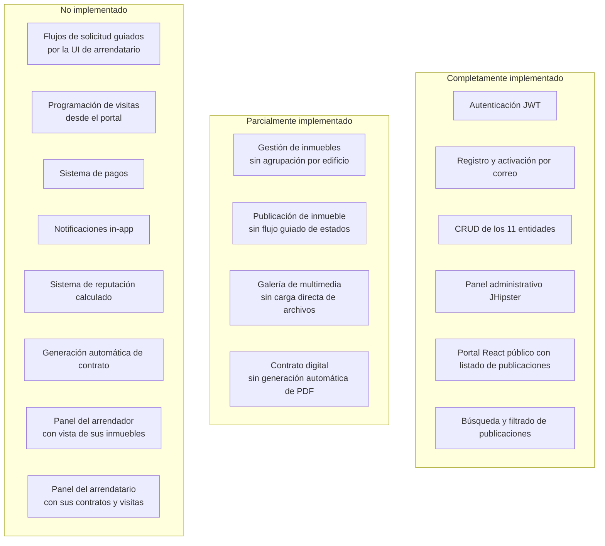
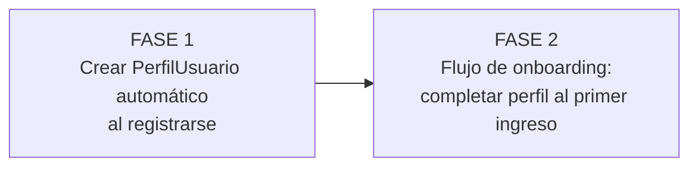
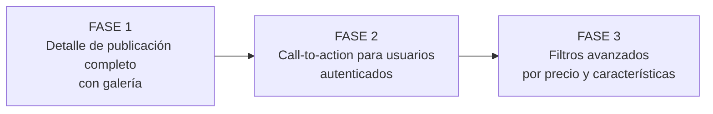
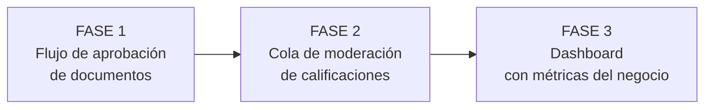
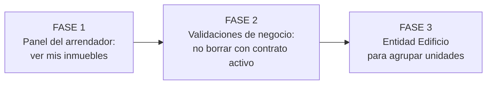
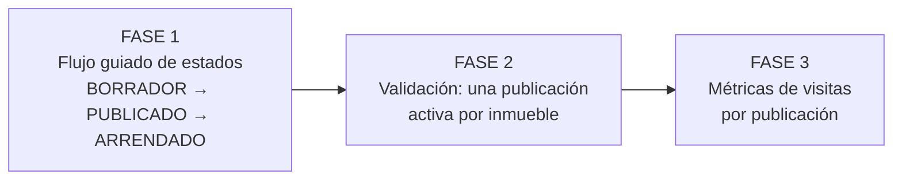
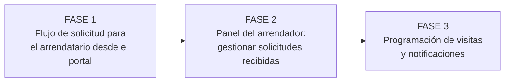
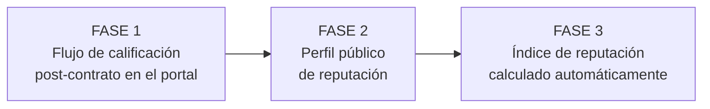
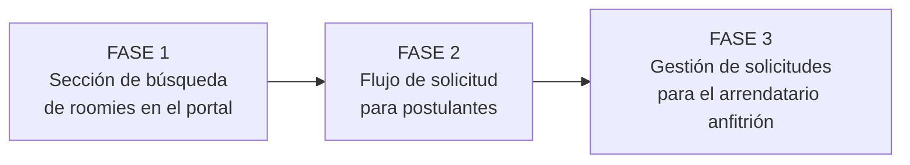
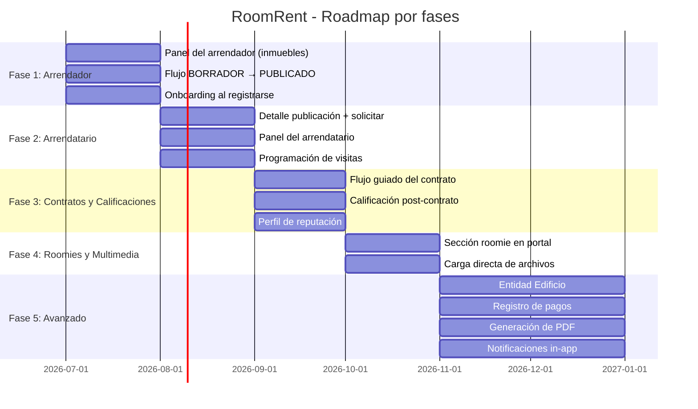

# 15 — Roadmap Funcional

## Metodología

El roadmap está organizado en fases. Cada fase se ejecuta solo después de que la fase anterior haya sido completamente revisada y aprobada. Ninguna funcionalidad entra en desarrollo sin documentación y aprobación previa.

```
Documentación → Revisión → Correcciones → Aprobación → Implementación
```

---

## Estado actual del sistema



---

## Módulo 1: Autenticación

**Estado:** ✅ Completamente funcional.

| Funcionalidad | Estado | Notas |
|---|---|---|
| Registro de usuario | ✅ | JHipster estándar |
| Activación por email | ✅ | JHipster estándar |
| Login con JWT | ✅ | Token en `localStorage` |
| Recuperación de contraseña | ✅ | JHipster estándar |
| Cambio de contraseña | ✅ | JHipster estándar |
| Logout | ✅ | JHipster estándar |
| Creación automática de PerfilUsuario al registrarse | ⚠️ Pendiente | El usuario se registra pero debe crear su PerfilUsuario manualmente |
| Perfil completo al primer ingreso (onboarding) | ❌ No implementado | — |

**Roadmap Módulo 1:**



---

## Módulo 2: Landing y Portal Público

**Estado:** ✅ React portal funcional en `/portal/`.

| Funcionalidad | Estado | Notas |
|---|---|---|
| Landing page con hero | ✅ | Implementado en React |
| Listado de publicaciones activas | ✅ | Paginado, con filtros |
| Búsqueda por texto | ✅ | |
| Filtro por ciudad, estrato, tipo de inmueble | ✅ | |
| Detalle de publicación | ⚠️ Parcial | Muestra datos, sin call-to-action para solicitar |
| Galería de fotos en el detalle | ⚠️ Parcial | Muestra URLs, sin carrusel |
| Botón "Solicitar visita" / "Contactar" | ❌ No implementado | Solo disponible si autenticado |
| Filtro por precio (rango) | ⚠️ Pendiente de validación | ¿Incluir este filtro? |

**Roadmap Módulo 2:**



---

## Módulo 3: Administración

**Estado:** ✅ Panel administrativo JHipster completo.

| Funcionalidad | Estado | Notas |
|---|---|---|
| Gestión de usuarios | ✅ | Panel JHipster |
| CRUD de todas las entidades | ✅ | Panel JHipster con tablas rediseñadas |
| Aprobación de documentos de verificación | ⚠️ Parcial | El campo `aprobado` existe; no hay flujo visual dedicado |
| Moderación de calificaciones | ⚠️ Parcial | El campo `visible` existe; no hay cola de moderación |
| Dashboard con estadísticas | ❌ No implementado | — |
| Alertas de acciones pendientes | ❌ No implementado | — |

**Roadmap Módulo 3:**



---

## Módulo 4: Gestión de Inmuebles

**Estado:** ⚠️ CRUD completo; sin flujos de arrendador.

| Funcionalidad | Estado | Notas |
|---|---|---|
| Crear inmueble | ✅ | CRUD disponible |
| Editar inmueble | ✅ | CRUD disponible |
| Eliminar inmueble | ✅ | Sin restricción si tiene contrato vigente |
| Ver mis inmuebles (panel arrendador) | ❌ No implementado | Solo accesible desde el panel admin |
| Agrupación por edificio | ❌ No implementado | Requiere entidad `Edificio` |
| Restricción de borrado con contrato vigente | ❌ No implementado | Regla de negocio pendiente |

**Roadmap Módulo 4:**



---

## Módulo 5: Publicaciones de Inmuebles

**Estado:** ⚠️ CRUD completo; sin flujo de estados guiado.

| Funcionalidad | Estado | Notas |
|---|---|---|
| Crear publicación | ✅ | CRUD disponible |
| Editar publicación | ✅ | CRUD disponible |
| Cambio de estado (BORRADOR → PUBLICADO) | ⚠️ Parcial | Campo editable, sin flujo guiado |
| Una sola publicación activa por inmueble | ❌ No implementado | Regla de negocio pendiente |
| Historial de publicaciones | ⚠️ Parcial | Los datos están; sin vista dedicada |
| Métricas de visualización | ❌ No implementado | Campo `cantidadVistas` no existe |

**Roadmap Módulo 5:**



---

## Módulo 6: Multimedia

**Estado:** ⚠️ CRUD de URLs; sin carga directa de archivos.

| Funcionalidad | Estado | Notas |
|---|---|---|
| Registrar URL de multimedia | ✅ | CRUD disponible |
| Marcar foto como principal | ✅ | Campo `principal` editable |
| Galería ordenable | ❌ No implementado | Campo `orden` no existe |
| Carga directa de archivos | ❌ No implementado | Requiere integración con almacenamiento externo |
| Validación de un solo `principal=true` | ❌ No implementado | Regla de negocio pendiente |
| Documentos de verificación del usuario | ⚠️ Parcial | `DocumentoUsuario` existe; sin flujo de carga en frontend de usuario |
| Foto de perfil de usuario | ❌ No implementado | Campo no existe en `PerfilUsuario` |

**Roadmap Módulo 6:**


---

## Módulo 7: Solicitudes y Visitas

**Estado:** ❌ Entidades existen; sin flujos de usuario en el portal.

| Funcionalidad | Estado | Notas |
|---|---|---|
| Enviar solicitud de arriendo desde la publicación | ❌ No implementado | Solo CRUD desde panel admin |
| Ver mis solicitudes enviadas (arrendatario) | ❌ No implementado | — |
| Ver solicitudes recibidas (arrendador) | ❌ No implementado | — |
| Aprobar / rechazar solicitud | ❌ No implementado | — |
| Programar visita desde la solicitud | ❌ No implementado | — |
| Confirmar / cancelar visita | ❌ No implementado | — |
| Notificaciones de cambio de estado | ❌ No implementado | — |

**Roadmap Módulo 7:**



---

## Módulo 8: Contratos

**Estado:** ⚠️ CRUD completo; sin generación automática de documentos.

| Funcionalidad | Estado | Notas |
|---|---|---|
| Crear contrato | ✅ | CRUD disponible |
| Adjuntar URL del documento | ✅ | Campo `urlContratoDigital` |
| Cambio de estado del contrato | ⚠️ Parcial | Campo editable, sin flujo guiado |
| Vista del contrato para el arrendatario | ❌ No implementado | — |
| Generación automática del PDF | ❌ No implementado | Propuesta futura |
| Firma electrónica | ❌ No implementado | Propuesta futura |
| Registro de pagos mensuales | ❌ No implementado | Entidad `PagoArriendo` no implementada |
| Historial de contratos por inmueble | ⚠️ Parcial | Datos disponibles; sin vista dedicada |

**Roadmap Módulo 8:**


---

## Módulo 9: Calificaciones

**Estado:** ⚠️ CRUD completo; sin flujo post-contrato en portal.

| Funcionalidad | Estado | Notas |
|---|---|---|
| Crear calificación | ✅ | CRUD disponible |
| Ver calificaciones de un usuario | ⚠️ Parcial | No hay perfil público de reputación |
| Habilitación de calificación al cerrar contrato | ❌ No implementado | Regla de negocio pendiente |
| Índice de reputación calculado | ❌ No implementado | Solo promedio manual |
| Niveles de confianza (Confiable, Verificado, etc.) | ❌ No implementado | Propuesta pendiente de validación |
| Moderación de calificaciones por admin | ⚠️ Parcial | Campo `visible` existe; sin cola de moderación |

**Roadmap Módulo 9:**



---

## Módulo 10: Roomies

**Estado:** ⚠️ CRUD completo; sin flujos guiados en portal.

| Funcionalidad | Estado | Notas |
|---|---|---|
| Publicar habitación para roomie | ✅ | CRUD disponible |
| Buscar habitaciones roomie desde portal | ⚠️ Parcial | No hay sección dedicada en el portal |
| Enviar solicitud de roomie | ❌ No implementado | Solo CRUD desde panel admin |
| Gestionar solicitudes recibidas (arrendatario) | ❌ No implementado | — |
| Habilitación de la función roomie (habilitadoRoomie) | ⚠️ Parcial | Campo existe; sin flujo de activación |
| Compatibilidad automática de perfiles | ❌ No implementado | Propuesta futura |

**Roadmap Módulo 10:**



---

## Vista consolidada del roadmap



---

## Prioridades inmediatas (post-aprobación de la documentación)

Estas son las funcionalidades de mayor impacto que deberían implementarse primero:

| Prioridad | Funcionalidad | Razón |
|---|---|---|
| 1 | Panel del arrendador para gestionar sus inmuebles | Sin esto, el flujo del arrendador es imposible sin acceso al panel admin |
| 2 | Detalle de publicación con "Solicitar arriendo" | Sin esto, el portal es solo informativo, no transaccional |
| 3 | Flujo de solicitud para el arrendatario | Core del negocio |
| 4 | Flujo de solicitud para el arrendador (aprobar/rechazar) | Complementa el flujo del arrendatario |
| 5 | Onboarding: crear PerfilUsuario al registrarse | Fricción alta para el nuevo usuario hoy |
| 6 | Flujo de contrato guiado | Formaliza la transacción |
| 7 | Calificación post-contrato en portal | Habilita el sistema de reputación |
| 8 | Sección roomie en portal | Diferenciador del producto |
