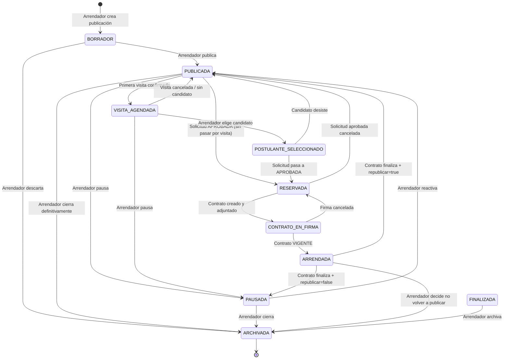
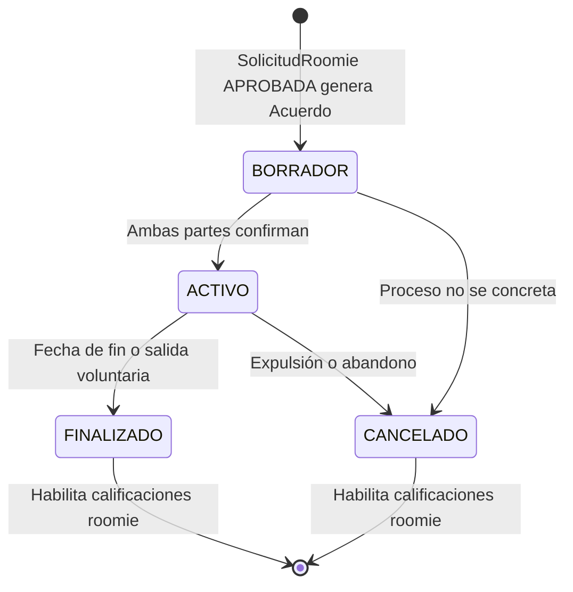
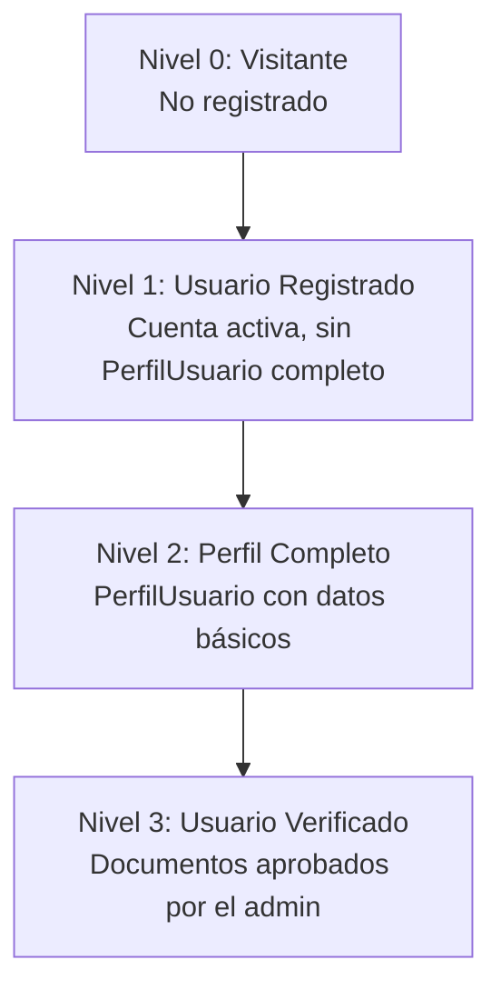

# 17 — Reglas de Negocio Definitivas

> **Autor:** Product Owner / Propietario del negocio  
> **Revisado por:** Arquitecto de Software Senior  
> **Estado:** APROBADO — Referencia oficial para implementación  
> **Fecha:** 2026-07-02  
>
> Este documento responde a las observaciones críticas identificadas en `16-revision-funcional.md`.  
> Las decisiones aquí registradas son definitivas y deben ser respetadas en toda implementación.  
> Cualquier cambio a estas reglas debe ser aprobado explícitamente por el Product Owner y reflejado en este documento antes de modificar código.

---

## Estructura del documento

1. [Jerarquía del dominio](#1-jerarquía-del-dominio)
2. [Ciclo de vida de la Publicación](#2-ciclo-de-vida-de-la-publicación)
3. [Calificaciones y Acuerdo de Convivencia Roomie](#3-calificaciones-y-acuerdo-de-convivencia-roomie)
4. [Regla de un solo contrato vigente por unidad](#4-regla-de-un-solo-contrato-vigente-por-unidad)
5. [Sistema de Notificaciones](#5-sistema-de-notificaciones)
6. [Historial de eventos](#6-historial-de-eventos)
7. [Expiración automática del contrato](#7-expiración-automática-del-contrato)
8. [Republicación automática de la publicación](#8-republicación-automática-de-la-publicación)
9. [Destino de las solicitudes al firmar contrato](#9-destino-de-las-solicitudes-al-firmar-contrato)
10. [Plazo para calificar](#10-plazo-para-calificar)
11. [Niveles de acceso por estado de verificación](#11-niveles-de-acceso-por-estado-de-verificación)
12. [Matriz de permisos CRUD por rol](#12-matriz-de-permisos-crud-por-rol)

---

## 1. Jerarquía del dominio

### Decisión definitiva

El "Inmueble" como entidad actual es insuficiente para el modelo completo. La jerarquía correcta del dominio es:

```
Propiedad (contenedor físico)
  └── Unidad (unidad arrendable independiente)
        └── Publicación (anuncio en el portal)
              └── Solicitud (candidato interesado)
                    └── Visita (cita presencial)
                          └── Contrato / Acuerdo (vínculo legal)
                                └── Ocupación (período de habitación)
                                      └── Calificación (evaluación al finalizar)
```

### Ejemplos concretos del modelo

**Caso 1: Edificio**
```
Edificio "Los Álamos" (Propiedad)
  ├── Apartamento 101 (Unidad)
  │     └── Publicación → Solicitudes → Visitas → Contrato → Ocupación → Calificación
  ├── Apartamento 102 (Unidad)
  │     └── Publicación → Solicitudes → Visitas → Contrato → Ocupación → Calificación
  └── Apartamento 201 (Unidad)
        └── Publicación → Solicitudes → Visitas → Contrato → Ocupación → Calificación
```

**Caso 2: Casa con habitaciones**
```
Casa "Patio Bonito" (Propiedad)
  ├── Habitación 1 (Unidad — arriendo directo)
  │     └── Publicación → Contrato → Ocupación
  ├── Habitación 2 (Unidad — arriendo directo)
  │     └── Publicación → Contrato → Ocupación
  └── Habitación 3 (Unidad — modalidad roomie)
        └── Publicación Roomie → Postulación → Acuerdo de Convivencia → Ocupación
```

**Caso 3: Apartamento con roomies**
```
Apartamento Kennedy (Unidad)
  ├── Contrato Arrendatario Principal (inquilino firma con propietario)
  │     └── Ocupación del arrendatario
  └── Publicación Roomie (publicada por el arrendatario)
        ├── Postulación Roomie A → Acuerdo Convivencia → Ocupación Roomie A
        └── Postulación Roomie B → Acuerdo Convivencia → Ocupación Roomie B
```

### Impacto en el modelo de datos actual

| Entidad actual | Equivale a | Acción requerida |
|---|---|---|
| `Inmueble` | **Unidad** | Renombrar conceptualmente. Agregar `ManyToOne → Propiedad` en la siguiente fase. |
| (no existe) | **Propiedad** | Crear entidad `Propiedad` (equivale al `Edificio` propuesto en doc 13) |
| `ContratoArriendo` | **Contrato** | Mantener. Representa el contrato formal arrendador↔arrendatario. |
| (no existe) | **AcuerdoConvivencia** | Crear entidad nueva. Representa el acuerdo entre arrendatario y roomie. Ver sección 3. |
| (no existe) | **Ocupación** | Registra el período real de habitación. Ver sección 6. |

> **Nota de implementación:** En la fase actual, el `Inmueble` sigue siendo la entidad Unidad. La creación de `Propiedad` es Fase 2 del roadmap. El `Inmueble` existente no se modifica todavía.

---

## 2. Ciclo de vida de la Publicación

### Decisión definitiva

El ciclo de vida aprobado para `PublicacionInmueble` es:

```
BORRADOR
   ↓ (arrendador publica)
PUBLICADA
   ↓ (candidato solicita visita)
VISITA_AGENDADA  ← (opcional, si se usa)
   ↓ (arrendador selecciona candidato)
POSTULANTE_SELECCIONADO
   ↓ (solicitud pasa a APROBADA)
RESERVADA
   ↓ (arrendador adjunta contrato y arrendatario firma)
CONTRATO_EN_FIRMA
   ↓ (contrato pasa a VIGENTE)
ARRENDADA
   ↓ (contrato pasa a FINALIZADO o CANCELADO)
FINALIZADA
   ↓ (arrendador archiva manualmente)
ARCHIVADA
```

**Transiciones adicionales posibles:**

| Desde | Hacia | Quién | Condición |
|---|---|---|---|
| PUBLICADA | PAUSADA | Arrendador | Decisión temporal de no recibir solicitudes |
| PAUSADA | PUBLICADA | Arrendador | Reanudación manual |
| PAUSADA | ARCHIVADA | Arrendador | Cierre definitivo |
| RESERVADA | PUBLICADA | Sistema | Si la solicitud aprobada se cancela antes del contrato |
| CONTRATO_EN_FIRMA | RESERVADA | Sistema | Si el proceso de firma se cancela |
| ARRENDADA | PUBLICADA | Sistema | Si el contrato termina y "republicar automáticamente" está activo |
| ARRENDADA | PAUSADA | Sistema | Si el contrato termina y "republicar automáticamente" está inactivo |

### Diagrama completo



### Reglas de la fase RESERVADA

Cuando una publicación está en `RESERVADA`:
1. **No se aceptan nuevas solicitudes.** El botón "Solicitar" desaparece en el portal.
2. **El portal muestra el estado visible: "Reservada".** Los visitantes y arrendatarios pueden verla pero saben que no está disponible.
3. **Las solicitudes existentes en estado `CREADA` o `EN_REVISION` quedan en estado `EN_ESPERA`.** El arrendador puede elegir cancelarlas o mantenerlas en espera por si el candidato seleccionado desiste.

> **Nuevo estado en `SolicitudArriendo`:** Agregar `EN_ESPERA` al enum `EstadoSolicitud`.

---

## 3. Calificaciones y Acuerdo de Convivencia Roomie

### Decisión definitiva

Las calificaciones **siempre deben estar ancladas a un documento formal**. No habrá calificaciones sin contexto.

La solución no es quitar la relación con el contrato, sino crear un documento equivalente para roomies: el **Acuerdo de Convivencia**.

### Modelo aprobado

Existe una jerarquía de acuerdos formales:

```
Acuerdo (abstracto — concepto)
  ├── ContratoArriendo      (arrendador ↔ arrendatario)
  └── AcuerdoConvivencia    (arrendatario ↔ roomie)
```

La entidad `Calificacion` puede estar vinculada a cualquiera de los dos.

### Entidad AcuerdoConvivencia (nueva)

| Campo | Tipo | Descripción |
|---|---|---|
| `id` | String | Identificador único |
| `fechaInicio` | LocalDate | Cuándo empieza la convivencia |
| `fechaFin` | LocalDate | Cuándo termina (puede ser indefinida) |
| `valorMensual` | Long | Lo que el roomie paga al anfitrión |
| `serviciosIncluidos` | TextBlob | Qué incluye el valor mensual |
| `estado` | EstadoAcuerdo | BORRADOR / ACTIVO / FINALIZADO / CANCELADO |
| `fechaFirma` | Instant | Cuándo ambas partes acordaron |
| `motivoCancelacion` | String | Si se cancela anticipadamente |
| `anfitrion` | → PerfilUsuario | El arrendatario que ofrece la habitación |
| `roomie` | → PerfilUsuario | El candidato roomie |
| `publicacionRoomie` | → PublicacionRoomie | La habitación acordada |
| `inmueble` | → Inmueble | El inmueble donde conviven |

### Ciclo de vida del AcuerdoConvivencia



### Modificación en Calificacion

La entidad `Calificacion` se modifica para soportar dos tipos de ancla:

| Campo | Tipo | Descripción |
|---|---|---|
| `tipoAncla` | TipoAncla | CONTRATO_ARRIENDO \| ACUERDO_CONVIVENCIA |
| `contratoArriendo` | → ContratoArriendo (nullable) | Para calificaciones de arriendo |
| `acuerdoConvivencia` | → AcuerdoConvivencia (nullable) | Para calificaciones roomie |

**Regla de validación:** Exactamente uno de los dos campos debe ser no-null. El tipo de calificación (`TipoCalificacion`) determina cuál:
- `ARRENDADOR_A_ARRENDATARIO` y `ARRENDATARIO_A_ARRENDADOR` → requieren `contratoArriendo`
- `ARRENDATARIO_A_ROOMIE` y `ROOMIE_A_ARRENDATARIO` → requieren `acuerdoConvivencia`

---

## 4. Regla de un solo contrato vigente por unidad

### Decisión definitiva

**Una unidad (Inmueble) no puede tener dos `ContratoArriendo` en estado `VIGENTE` al mismo tiempo.**

Esta regla aplica por **Inmueble** (unidad), no por edificio o propietario.

### Escenarios válidos e inválidos

**VÁLIDO:** Dos apartamentos del mismo edificio, cada uno con su contrato vigente.
```
Edificio
  ├── Apartamento 101  →  Contrato A (VIGENTE con María)    ✅
  └── Apartamento 102  →  Contrato B (VIGENTE con Carlos)   ✅
```

**INVÁLIDO:** Un solo apartamento con dos contratos vigentes.
```
Apartamento 101
  ├── Contrato A (VIGENTE con María)    ✅
  └── Contrato B (VIGENTE con Carlos)   ❌ — PROHIBIDO
```

### Enforcement

1. **A nivel de servicio (backend):** Antes de cambiar el estado de un contrato a `VIGENTE`, el sistema debe verificar que no exista otro contrato con estado `VIGENTE` para el mismo `inmueble.id`. Si existe, lanzar error con mensaje: `"El inmueble ya tiene un contrato vigente. Finalice el contrato actual antes de crear uno nuevo."`

2. **A nivel de base de datos (MongoDB):** Crear un índice parcial único: `{inmueble: 1, estado: 1}` con condición `{estado: "VIGENTE"}`. Esto garantiza unicidad a nivel de motor.

3. **A nivel de UI:** El botón "Crear contrato" debe estar deshabilitado si el inmueble tiene un contrato en estado `VIGENTE` o `PENDIENTE_FIRMA`.

---

## 5. Sistema de Notificaciones

### Decisión definitiva

Crear una entidad `Notificacion` desde el inicio. Todas las notificaciones del sistema pasan por esta entidad. Esto permite agregar email, push o WhatsApp en el futuro sin cambiar el modelo.

### Entidad Notificacion (nueva)

| Campo | Tipo | Descripción |
|---|---|---|
| `id` | String | Identificador único |
| `usuario` | → PerfilUsuario | Destinatario de la notificación |
| `titulo` | String | Asunto corto (máx. 100 chars) |
| `mensaje` | String | Cuerpo del mensaje |
| `tipo` | TipoNotificacion | Ver enum abajo |
| `leida` | Boolean | false por defecto |
| `fechaCreacion` | Instant | Cuándo se generó |
| `urlDestino` | String | Ruta a donde navegar al hacer clic (opcional) |

### TipoNotificacion (enum)

| Valor | Cuándo se genera |
|---|---|
| `NUEVA_SOLICITUD` | El arrendador recibe una nueva solicitud |
| `SOLICITUD_APROBADA` | El arrendatario es aprobado |
| `SOLICITUD_RECHAZADA` | El arrendatario es rechazado |
| `SOLICITUD_EN_ESPERA` | La solicitud pasa a EN_ESPERA por RESERVADA |
| `VISITA_SOLICITADA` | El arrendador recibe solicitud de visita |
| `VISITA_CONFIRMADA` | El arrendatario recibe confirmación de visita |
| `VISITA_CANCELADA` | Cualquiera recibe aviso de cancelación |
| `CONTRATO_LISTO` | El arrendatario es notificado para firmar |
| `CONTRATO_VIGENTE` | Ambas partes reciben confirmación |
| `CONTRATO_FINALIZADO` | Ambas partes son notificadas |
| `CALIFICACION_DISPONIBLE` | El período de calificación está habilitado |
| `DOCUMENTO_APROBADO` | El usuario recibe aprobación de documento |
| `DOCUMENTO_RECHAZADO` | El usuario recibe rechazo con observaciones |
| `NUEVA_POSTULACION_ROOMIE` | El anfitrión recibe postulación de roomie |
| `POSTULACION_ROOMIE_APROBADA` | El roomie es aprobado |
| `POSTULACION_ROOMIE_RECHAZADA` | El roomie es rechazado |

### Reglas del sistema de notificaciones

1. Las notificaciones se generan automáticamente por el backend en cada transición de estado relevante.
2. Las notificaciones no se eliminan — solo se marcan como leídas.
3. Una notificación de calificación incluye la `urlDestino` que lleva directamente al formulario de calificación.
4. El sistema in-app es la capa base. Email (vía MailService de JHipster) puede activarse como capa adicional en el futuro.

---

## 6. Historial de eventos

### Decisión definitiva

El sistema **no debe sobrescribir datos históricos**. Cualquier cambio de valor en un campo crítico debe conservar el valor anterior.

### Campos que generan historial

| Entidad | Campos con historial |
|---|---|
| `PublicacionInmueble` | `canonArriendo`, `estado`, `descripcion` |
| `ContratoArriendo` | `estado`, `valorMensual`, `fechaFin` |
| `Inmueble` | `areaMetrosCuadrados`, `numeroHabitaciones`, `estrato` |
| `SolicitudArriendo` | `estado`, `motivoCambioEstado` |
| `AcuerdoConvivencia` | `estado`, `valorMensual` |
| `DocumentoUsuario` | `aprobado`, `observaciones` |

### Implementación propuesta: campos de auditoría mínimos

Como primer paso (sin Event Sourcing completo), agregar a cada entidad con estados los siguientes campos:

| Campo | Tipo | Descripción |
|---|---|---|
| `fechaCambioEstado` | Instant | Cuándo cambió el estado por última vez |
| `estadoAnterior` | String | Estado previo antes del cambio |
| `motivoCambioEstado` | String | Razón del cambio (texto libre, registrado por el usuario) |
| `cambiadoPor` | → User | Quién ejecutó el cambio |

### Historial de precios — caso especial

Para `PublicacionInmueble.canonArriendo`, el historial se registra en una entidad separada:

**Entidad `HistorialPrecio` (nueva):**

| Campo | Tipo | Descripción |
|---|---|---|
| `id` | String | Identificador |
| `publicacion` | → PublicacionInmueble | A qué publicación pertenece |
| `valorAnterior` | Long | Precio antes del cambio |
| `valorNuevo` | Long | Nuevo precio |
| `fechaCambio` | Instant | Cuándo cambió |
| `registradoPor` | → User | Quién lo cambió |

**Regla:** Cada vez que se modifica `canonArriendo` en una publicación existente, se crea un registro en `HistorialPrecio` antes de actualizar el valor.

### Historial de ocupantes

**Entidad `OcupacionUnidad` (nueva, equivale al `OcupanteContrato` propuesto en doc 13):**

| Campo | Tipo | Descripción |
|---|---|---|
| `id` | String | Identificador |
| `inmueble` | → Inmueble | La unidad |
| `ocupante` | → PerfilUsuario | Quien habitó |
| `tipoOcupante` | TipoOcupante | ARRENDATARIO \| ROOMIE |
| `fechaIngreso` | LocalDate | Cuándo ingresó |
| `fechaSalida` | LocalDate | Cuándo salió (null si sigue activo) |
| `contrato` | → ContratoArriendo (nullable) | Para arrendatarios |
| `acuerdoConvivencia` | → AcuerdoConvivencia (nullable) | Para roomies |
| `estado` | EstadoOcupacion | ACTIVA \| FINALIZADA \| CANCELADA |

**Regla:** Se crea un registro de `OcupacionUnidad` cuando un contrato o acuerdo de convivencia pasa a `VIGENTE` / `ACTIVO`. Se cierra (`fechaSalida = hoy`) cuando el contrato o acuerdo pasa a `FINALIZADO` o `CANCELADO`.

---

## 7. Expiración automática del contrato

### Decisión definitiva

**El contrato pasa a `FINALIZADO` automáticamente cuando `fechaFin < fecha actual`.**

### Reglas exactas

1. **Mecanismo:** El sistema ejecuta una tarea programada (cron job) diariamente a las 00:01 AM.

2. **Criterio:** Si un `ContratoArriendo` tiene `estado = VIGENTE` y `fechaFin < hoy`, el sistema:
   - Cambia `estado → FINALIZADO`
   - Registra `fechaCambioEstado = ahora`
   - Registra `motivoCambioEstado = "Finalización automática por vencimiento de fecha"`
   - Cierra la `OcupacionUnidad` correspondiente
   - Actualiza el estado de la `PublicacionInmueble` según la regla de republicación (ver sección 8)
   - Genera notificaciones `CONTRATO_FINALIZADO` para arrendador y arrendatario
   - Habilita el período de calificación (genera notificaciones `CALIFICACION_DISPONIBLE`)

3. **Finalización anticipada:** Si arrendador o arrendatario acuerdan terminar antes, cualquiera de los dos puede iniciar el proceso de cancelación anticipada. El estado pasa a `CANCELADO` con `motivoCambioEstado` requerido. No es automático — requiere acción explícita.

4. **Bloqueo:** Una vez que el contrato está en `FINALIZADO` o `CANCELADO`, no puede volver a ningún estado anterior.

---

## 8. Republicación automática de la publicación

### Decisión definitiva

Cuando un contrato pasa a `FINALIZADO` o `CANCELADO`, el comportamiento de la publicación depende de la configuración del arrendador.

### Campo nuevo en Inmueble o PublicacionInmueble

Agregar campo: `republicarAutomaticamente: Boolean` (default: `false`)

### Reglas de transición

| `republicarAutomaticamente` | Estado del contrato | Estado resultante de la publicación |
|---|---|---|
| `true` | FINALIZADO | PUBLICADA |
| `true` | CANCELADO | PUBLICADA |
| `false` | FINALIZADO | PAUSADA |
| `false` | CANCELADO | PAUSADA |

**Cuando queda PUBLICADA automáticamente:**
- Se notifica al arrendador: "Tu inmueble está disponible nuevamente en el portal."
- La publicación conserva el mismo `canonArriendo` y condiciones.
- El arrendador puede editar los datos antes de que aparezca en el portal si lo desea.

**Cuando queda PAUSADA automáticamente:**
- Se notifica al arrendador: "Tu contrato finalizó. Tu publicación fue pausada. Reactívala cuando estés listo."
- El arrendador debe activarla manualmente.

---

## 9. Destino de las solicitudes al firmar contrato

### Decisión definitiva

Cuando el `ContratoArriendo` pasa a estado `VIGENTE` (ambas partes han firmado):

1. La solicitud ganadora pasa a: **no cambia de estado** (ya está en APROBADA — el contrato es la evidencia de que fue aceptada).

2. **Todas las demás solicitudes** de esa publicación que estén en estado `CREADA`, `EN_REVISION` o `EN_ESPERA` pasan automáticamente a:  **RECHAZADA**

3. Se genera una `Notificacion` de tipo `SOLICITUD_RECHAZADA` para cada candidato afectado, con mensaje: `"El inmueble que solicitaste ha sido arrendado. Te invitamos a explorar otras opciones en el portal."`

4. El arrendador no necesita rechazarlas manualmente.

### Tabla de estados resultantes

| Estado actual de la solicitud | Al firmar contrato | Notificación |
|---|---|---|
| APROBADA (ganadora) | Sin cambio | `CONTRATO_VIGENTE` |
| CREADA | → RECHAZADA | `SOLICITUD_RECHAZADA` |
| EN_REVISION | → RECHAZADA | `SOLICITUD_RECHAZADA` |
| EN_ESPERA | → RECHAZADA | `SOLICITUD_RECHAZADA` |
| RECHAZADA (ya rechazada antes) | Sin cambio | Sin notificación |
| CANCELADA | Sin cambio | Sin notificación |

---

## 10. Plazo para calificar

### Decisión definitiva

**El período de calificación está habilitado durante exactamente 15 días calendario después de que el contrato o acuerdo pase a `FINALIZADO` o `CANCELADO`.**

### Reglas exactas

1. El período comienza en el momento exacto en que el contrato/acuerdo cambia a estado terminal (`FINALIZADO` o `CANCELADO`).

2. El sistema calcula `fechaLimiteCalificacion = fechaCambioEstado + 15 días`.

3. La calificación solo puede emitirse si `hoy <= fechaLimiteCalificacion`.

4. Después de 15 días, el botón de calificación desaparece y aparece el mensaje: `"El período de calificación cerró el [fecha]."`

5. Las calificaciones ya emitidas quedan permanentemente en el historial.

6. La calificación es **bidireccional pero no simultánea**: cada parte califica de forma independiente. No se requiere que ambas califiquen para que la calificación de una sea válida.

7. Cada parte puede calificar **una sola vez** por contrato/acuerdo. No hay edición post-publicación.

### Campo nuevo en ContratoArriendo y AcuerdoConvivencia

Agregar: `fechaLimiteCalificacion: LocalDate` — calculado automáticamente al pasar a estado terminal.

---

## 11. Niveles de acceso por estado de verificación

### Decisión definitiva

El sistema usa un modelo de acceso escalonado. No bloquea la plataforma desde el inicio, pero protege las operaciones de alto valor.

### Niveles de acceso



### Capacidades por nivel

| Acción | Nivel 0 | Nivel 1 | Nivel 2 | Nivel 3 |
|---|---|---|---|---|
| Navegar el portal | ✅ | ✅ | ✅ | ✅ |
| Ver detalle de publicación | ✅ | ✅ | ✅ | ✅ |
| Ver perfil público de arrendador | ✅ | ✅ | ✅ | ✅ |
| Registrarse | ✅ | — | — | — |
| Iniciar sesión | — | ✅ | ✅ | ✅ |
| **Solicitar visita a un inmueble** | ❌ | ❌ | ✅ | ✅ |
| **Enviar solicitud de arriendo** | ❌ | ❌ | ✅ | ✅ |
| **Postularse como roomie** | ❌ | ❌ | ✅ | ✅ |
| **Firmar contrato** | ❌ | ❌ | ❌ | ✅ |
| **Publicar inmueble** | ❌ | ❌ | ❌ | ✅ |
| **Publicar habitación roomie** | ❌ | ❌ | ❌ | ✅ |
| **Aprobar solicitudes** | ❌ | ❌ | ❌ | ✅ |
| **Generar contrato** | ❌ | ❌ | ❌ | ✅ |
| **Emitir calificaciones** | ❌ | ❌ | ❌ | ✅ |

### Cómo el sistema identifica el nivel

| Nivel | Condición |
|---|---|
| Nivel 0 | No tiene token JWT |
| Nivel 1 | Tiene token JWT, pero `PerfilUsuario` no existe o está incompleto |
| Nivel 2 | Tiene token JWT, `PerfilUsuario` completo, `verificado = false` |
| Nivel 3 | Tiene token JWT, `PerfilUsuario` completo, `verificado = true` |

### ¿Qué es "PerfilUsuario completo"?

Se considera completo cuando tiene como mínimo:
- `primerNombre` y `primerApellido`
- `tipoDocumento` y `numeroDocumento`
- `telefono`
- `ciudad`

No se requieren todos los campos opcionales (biografía, intereses, etc.) para considerarlo completo.

### ¿Qué activa `verificado = true`?

El administrador aprueba manualmente los documentos del usuario en el panel de administración. Cuando **al menos un documento está aprobado**, el sistema cambia `verificado = true` automáticamente.

> **Decisión futura:** En versiones posteriores se puede definir una lista de documentos mínimos requeridos por tipo de operación (firmar contrato, publicar inmueble, etc.). Por ahora, un documento aprobado es suficiente.

---

## 12. Matriz de permisos CRUD por rol y entidad

Esta matriz define quién puede ejecutar operaciones sobre cada entidad. Se usa como referencia para la implementación de seguridad en el backend.

**Convención:**
- `C` = Create
- `R` = Read (propio) / `R*` = Read (todos)
- `U` = Update
- `D` = Delete
- `—` = Sin acceso
- `(cond)` = Con condiciones documentadas

| Entidad | Visitante | Arrendatario | Arrendador | Admin |
|---|---|---|---|---|
| **User** | — | R (propio) | R (propio) | CRUD* |
| **PerfilUsuario** | R* (público) | CRUD (propio) | CRUD (propio) | CRUD* |
| **DocumentoUsuario** | — | CRD (propios) | CRD (propios) | CRUD* |
| **Inmueble** | — | — | CRUD (propios, con cond.) | CRUD* |
| **PublicacionInmueble** | R* (PUBLICADA) | R* (PUBLICADA) | CRUD (propias, con cond.) | CRUD* |
| **MultimediaInmueble** | R* | R* | CRUD (propias) | CRUD* |
| **SolicitudArriendo** | — | CRD (propias) | R, U estado (recibidas) | CRUD* |
| **VisitaProgramada** | — | CR (propias), U estado | CR, U estado (propias) | CRUD* |
| **ContratoArriendo** | — | R (donde es arrendatario) | CRUD (propios, con cond.) | CRUD* |
| **AcuerdoConvivencia** | — | CRU (donde es anfitrión) | — | CRUD* |
| **PublicacionRoomie** | R* (PUBLICADA) | CRUD (propias) | — | CRUD* |
| **SolicitudRoomie** | — | CRD (propias) | — | CRUD* |
| **Calificacion** | R* (visible=true) | CR (propias, con cond.) | CR (propias, con cond.) | CRUD* |
| **Notificacion** | — | RU (propias) | RU (propias) | R* |
| **OcupacionUnidad** | — | R (donde es ocupante) | R (sus inmuebles) | CRUD* |
| **HistorialPrecio** | — | R* | R (propias) | R* |

### Condiciones especiales

| Entidad | Condición |
|---|---|
| Inmueble: Eliminar | Solo si no tiene contratos VIGENTE, PENDIENTE_FIRMA; ni solicitudes APROBADA; ni publicaciones PUBLICADA, RESERVADA, ARRENDADA |
| PublicacionInmueble: Eliminar | Solo si está en BORRADOR, ARCHIVADA o PAUSADA |
| ContratoArriendo: Update | El arrendatario solo puede confirmar firma. El arrendador puede editar en BORRADOR. Nadie edita un contrato VIGENTE salvo para finalizarlo. |
| Calificacion: Create | Solo si el contrato/acuerdo está FINALIZADO o CANCELADO, y el plazo de 15 días no ha vencido, y el usuario no ha calificado ese contrato/acuerdo antes. |
| SolicitudArriendo: Create | Solo para publicaciones en estado PUBLICADA o VISITA_AGENDADA. |

---

## Apéndice: Resumen de entidades nuevas aprobadas

Las siguientes entidades deben crearse en la siguiente fase de implementación:

| Entidad | Prioridad | Descripción |
|---|---|---|
| `Notificacion` | ALTA | Notificaciones in-app por tipo de evento |
| `AcuerdoConvivencia` | ALTA | Acuerdo formal entre arrendatario y roomie |
| `OcupacionUnidad` | ALTA | Historial de quién vivió en cada unidad |
| `HistorialPrecio` | MEDIA | Historial de cambios de precio por publicación |
| `Propiedad` | BAJA (Fase 2) | Contenedor de múltiples unidades (edificio, casa) |

## Apéndice: Resumen de modificaciones a entidades existentes

| Entidad | Campo a agregar | Tipo | Descripción |
|---|---|---|---|
| `PublicacionInmueble` | `estado` | Actualizar enum | Agregar: VISITA_AGENDADA, POSTULANTE_SELECCIONADO, RESERVADA, CONTRATO_EN_FIRMA, ARRENDADA, FINALIZADA, ARCHIVADA |
| `PublicacionInmueble` | `republicarAutomaticamente` | Boolean | Si el sistema reactiva la publicación al finalizar contrato |
| `PublicacionInmueble` | `fechaCambioEstado` | Instant | Auditoría de cambios de estado |
| `PublicacionInmueble` | `estadoAnterior` | String | Estado previo |
| `PublicacionInmueble` | `motivoCambioEstado` | String | Razón del cambio |
| `SolicitudArriendo` | `estado` | Actualizar enum | Agregar: EN_ESPERA |
| `ContratoArriendo` | `fechaLimiteCalificacion` | LocalDate | Calculado al finalizar/cancelar |
| `ContratoArriendo` | `fechaCambioEstado` | Instant | Auditoría |
| `ContratoArriendo` | `motivoCambioEstado` | String | Razón del cambio |
| `Calificacion` | `tipoAncla` | TipoAncla enum | CONTRATO_ARRIENDO o ACUERDO_CONVIVENCIA |
| `Calificacion` | `acuerdoConvivencia` | → AcuerdoConvivencia (nullable) | Para calificaciones roomie |
| `Calificacion` | `contratoArriendo` | Hacer nullable | Para calificaciones roomie |
| Todas las entidades con estado | `fechaCambioEstado`, `estadoAnterior`, `motivoCambioEstado`, `cambiadoPor` | Instant, String, String, → User | Auditoría mínima de cambios |
